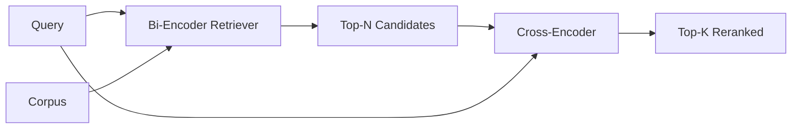

# Cross-Encoder 重排器

> bi-encoder 会独立地嵌入 query 和 document。cross-encoder 则把它们拼在一起，一次性同时读入。cross-encoder 是最聪明的读者，也是最慢的。把它放在 bi-encoder 的 top-k 之后作为第二阶段，付出的成本是值得的。

**Type:** 构建
**Languages:** Python
**Prerequisites:** 第 11 阶段第 06 课（RAG）、第 07 课（advanced RAG）；第 19 阶段 Track B 基础课（第 20–29 课）；第 19 阶段第 65 课（为本阶段提供输入的 hybrid retrieval）
**Time:** 约 90 分钟

## 学习目标
- 按输入形状、参数量和单次查询成本，区分 bi-encoder retriever 与 cross-encoder reranker。
- 从零实现一个小型 cross-encoder，把它做成一个接收打包 (query, document) 序列并输出单个相关性标量的 transformer block。
- 接好两阶段 retrieve-then-rerank pipeline：先用便宜的 retriever 取 top-N，再用 cross-encoder 把 N 重新排到 top-K，最后返回 K。
- 在一个小型 fixture corpus 上测量 latency-vs-quality 的权衡，并为给定的延迟预算选出合适的 N。

## 问题

bi-encoder 会把 query 与 document 映射到同一个向量空间里，再按 cosine 排序。两个编码过程彼此看不见。模型必须在不知道 query 是什么的情况下，把一个文档里所有有用的信息压缩进单个向量。这种方式很快，因为索引时每个 document 只 embed 一次，查询时每个 query 也只 embed 一次；而且在 corpus 级别做排序时，这基本上也是唯一可行的方法。

代价是 precision。两个文档即便只是共享同一个大主题，它们的 embedding 也可能非常接近，而实际上一个回答了 query，另一个没有。bi-encoder 无法在这种细粒度层面上把它们区分开。

cross-encoder 的做法是把 query 和 document 一起读进去。模型接收 `[query] [SEP] [document]` 这样的单序列，对整个拼接后的序列做 full attention，然后输出一个 relevance scalar。文档的每个 token 都能 attend 到 query 的每个 token，最终得分是在完整上下文里算出来的。

代价是吞吐量。bi-encoder 是 embed 一次、查很多次；cross-encoder 则要对每个 (query, document) 对都跑一遍。假设你的语料有一千万份文档，那就是每个 query 都要做一千万次 forward pass，在请求预算内根本跑不动。

解决方案是分阶段。先用 bi-encoder 取 top-N，再用 cross-encoder 把这 N 个候选重排到 top-K。N 很小，通常是 50 到 200，而 cross-encoder 的质量提升也正集中在这里。总延迟仍留在请求预算内。系统的最终质量接近 cross-encoder，但上限仍受 bi-encoder 在 N 上的 recall 限制。

## 概念



### Cross-encoder 的输入形状

标准打包方式是 `[CLS] query_tokens [SEP] document_tokens [SEP]`。有些实现会用 mean-pooling 而不是 CLS 位，但差异通常不大。重点在于：模型对每个 pair 只产出一个数字。

一个大约 22M 参数的 cross-encoder，也就是公开可用的 `ms-marco-MiniLM-L-6-v2` 这个量级，是常见的生产折中点。更小的模型，质量损失通常快于它节省下来的延迟。更大的模型，例如 568M 参数的 `bge-reranker-v2-m3`，一般只保留给离线重排，或者首页级的小 K 重排。

### 为什么这节课只训练一个小模型

真实的 cross-encoder 通常是一个 fine-tuned encoder transformer。生产里你会直接加载 checkpoint 然后运行。而本课的目标不是训练 state-of-the-art ranker，而是让你看清模型的形状，以及 latency-quality curve 的形状。所以我们只实现一个小型 `nn.Module`：一层 transformer block，加 multi-head attention（默认 4 heads），再加一个 regression head。模型通过种子进行确定性初始化，因此不需要磁盘权重也能复现实验。

这个 toy model 在 fixture corpus 上能学到正确的形状：相关的 query-document 对会拿到比无关 pair 更高的分数。整个端到端 pipeline 会对 bi-encoder 的输出重新排序，而 rerank 后的 top-k 会与 gold labels 更一致。

### 延迟与质量

把 N 从 5 扫到 100，在 held-out query set 上就能得到一条曲线。

| N | 第二阶段的 Recall@1 | 每个查询需要的 cross-encoder 前向次数 | 延迟 |
|---|--------------------|---------------------------------------|---------|
| 5 | 0.62 | 5 | 低 |
| 20 | 0.81 | 20 | 中 |
| 50 | 0.86 | 50 | 高 |
| 100 | 0.86 | 100 | 非常高 |

上表里的数字只是为了说明曲线形状，并不是这个 fixture 的真实测量值。但这种形状是真实存在的。通常都会在 20 到 50 个候选附近出现一个 knee，rerank 带来的提升会在这里逐渐饱和。过了这个拐点，继续加 N 就只是付出更多算力，却不再换来明显收益。

N 的选择应该来自 eval curve 加延迟预算。cross-encoder 无法把 recall 提高到超过 bi-encoder 在 N 上的 recall，所以 N 过小，不只是延迟低，更是直接给质量封顶。

```figure
rerank-funnel
```

## 动手实现

`code/main.py` 实现了：

- `CrossEncoder`，一个小型 `torch.nn.Module`：包含 token embedding、一层带 multi-head attention 和 feedforward 的 transformer block，以及一个 mean-pooled head，用来产出单个标量。
- `tokenize_pair(query, document)`，把两个字符串打包成单个 id 序列，同时附带 type ids 标记边界，整个过程是确定性的并且只依赖 stdlib。
- `train_tiny(pairs)`，在一组手工标注的 (query, document, relevance) 三元组上跑一轮监督训练，让模型能在 fixture 上产出有意义的分数。
- `rerank(query, candidates, top_k)`，也就是生产接口。
- `pipeline(query, retriever, top_n, top_k)`，完整的两阶段流程。
- 一个 demo `main()`：它会加载与第 65 课同型的语料，先检索 top-N，再重排到 top-K，打印两个列表，并报告每一阶段的延迟。

运行它:

```bash
python3 code/main.py
```

输出里会展示 bi-encoder 的 top-N、cross-encoder 的 top-K，以及一个 timing summary。cross-encoder 单次调用更慢，但它不会在整个 corpus 上跑。两阶段总延迟依然能压在请求预算内，同时把那个原本被 bi-encoder 排在第二或第三位的真正答案重新提到最前面。

## Demo 无法暴露的失败模式

**Cross-encoder is not symmetric.** `rerank(q, d)` 和 `rerank(d, q)` 的分数不一样。query 必须始终放前面。一旦交换，recall 会直接塌掉。

**N is too low to expose the bug.** 如果你把 N 设成 K，cross-encoder 就没有真正的重排空间，只能重新打分。这样看起来 lift 近乎为零。经验上，N 至少应当是 K 的三倍。

**Training data leaks into the eval.** 如果手工标注训练对里混进了 eval queries，rerank 会看起来像魔法一样强。即便只是 fixture，也必须严格隔离 train 和 eval。

**Production weights are dense.** 一个 22M 参数的 cross-encoder 在 float32 下大约是 88MB。你要在承诺 sub-100ms p95 之前，先把模型服务的内存预算算清楚。

**Batching matters.** 真正的 cross-encoder 会把 N 个候选放进同一个 batch。本课里的 `_batch_encode` 就是这么做的：它构建 batched id 和 type-id tensors，用 `torch.tensor(...)` 一次 forward 完成。如果跳过 batching，延迟会直接按 N 倍放大。

## 用它

生产实践：

- 把 bi-encoder、cross-encoder 与 N 绑定在一起看。三者任意一个变了，之前的 eval 就作废。
- 按 (query, document_id) hash 缓存 reranker 输出。面对稳定语料时，同一个 query 的 rerank 顺序本来就会稳定，命中缓存就是白赚的延迟削减。
- 记录 rank-1 的 cross-encoder score。如果一个 query 的 top-1 分数低于某个 corpus-specific threshold，就把它视作 out-of-domain hit，并向 LLM 显式传达 “I am not confident”。

## 放进系统里

第 68 课会对这个两阶段 pipeline 做端到端评估。第 69 课会把本课 reranker 接在第 65 课的 hybrid retriever 后面、answer generator 前面。reranker 是整个端到端系统的第二阶段。

## 练习

1. 把 N 从 5 扫到 50，画出 reranked output 的 recall@1 曲线。在这个 fixture 上找出 knee。
2. 把 cross-encoder 训练 10 个 epoch，而不是 1 个。观察每一轮正负样本的 score margin 如何变化。
3. 把 mean-pooling 换成 CLS-token head。比较它在这个 fixture 上的收敛情况。
4. 给 cross-encoder 增加第二个 head，预测一个二元标签：“答案是否真的在文档里”。推理时两个 head 一起用：一个负责排序，一个负责阈值过滤。
5. 用第 65 课的 bi-encoder 替换这里的确定性 mock 版本，把两阶段真正串起来，测 top-K 相比 bi-encoder 单独使用的变化。

## 关键术语

| 术语 | 人们常说的话 | 它真正表示什么 |
|------|-----------------|------------------------|
| Bi-encoder | "Vector retriever" | 独立编码 query 和 doc；再按 cosine 排序 |
| Cross-encoder | "Reranker" | 联合编码 (query, doc)；输出单个相关性标量 |
| Two-stage pipeline | "先检索再重排" | 廉价 retriever 返回 N，昂贵 reranker 保留 K |
| N (candidate budget) | "重排候选池" | cross-encoder 每个 query 要打分的候选数 |
| Mean-pooling head | "最后一层隐藏状态取均值" | 对 encoder 最后一层输出取平均，得到一个向量 |

## 进一步阅读

- Nogueira, Cho, "Passage Re-ranking with BERT", 2019 - 经典 cross-encoder reranker 论文
- Reimers, Gurevych, "Sentence-BERT: Sentence Embeddings using Siamese BERT-Networks", 2019 - bi-encoder 与 cross-encoder 的经典对照
- [SentenceTransformers Cross-Encoders documentation](https://www.sbert.net/examples/applications/cross-encoder/README.html)
- [BGE Reranker v2 模型卡](https://huggingface.co/BAAI/bge-reranker-v2-m3)
- 第 19 阶段第 65 课 - 为这一 rerank 阶段提供输入的 hybrid retriever
- 第 19 阶段第 68 课 - 衡量这一 rerank 带来提升的评测
