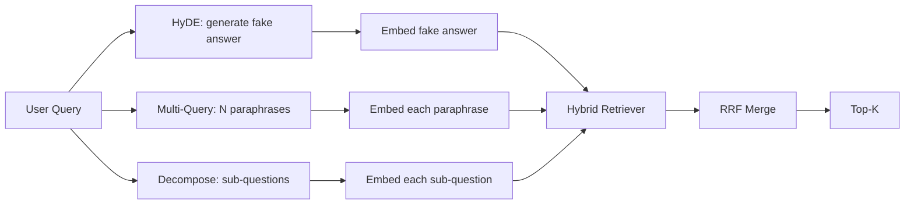

# 查询重写：HyDE、多查询与分解

> 用户输入的查询，并不是 retriever 真正想看到的查询。查询重写的作用，就是在检索发生前先把这道缝补上，让索引看到的内容更接近“答案会长成什么样”。

**Type:** 构建
**Languages:** Python
**Prerequisites:** 第 11 阶段第 04 课（embeddings）、第 06 课（RAG）；第 19 阶段 Track B 基础课（第 20–29 课）；第 19 阶段第 64 与 65 课
**Time:** 约 90 分钟

## 学习目标
- 实现 Hypothetical Document Embeddings（HyDE）：先生成一段假的答案文本，对它做 embedding，再用这个向量而不是原查询向量去检索。
- 实现多查询扩展：把一个查询重写成 N 个释义版本，对每个版本分别检索，再用 reciprocal rank fusion 合并结果。
- 实现查询分解：把复杂问题拆成多个子问题，分别检索后再合并。
- 在同一组 fixture 上正面对比这三种重写策略，并说明各自何时更有效。
- 接入一个输出可复现、在 fixture 上行为确定的 mock LLM，让整个重写循环可以离线运行。

## 问题

用户输入一句话：“what does our team do when uploads fail and the budget is gone?” 但语料库里的文档写的是：“AbortMultipartOnFail aborts an in-flight S3 multipart upload and decrements the per-bucket retry budget when the upload fails”。查询和文档没有共享同一个名词短语。BM25 会漏掉它。双塔编码器也只会把这篇文档排在第三或第四，因为查询向量落在 embedding space 的另一个区域，更偏向那篇讲 cancelled jobs 的文档，而不是这篇讲 aborted uploads 的文档。第 66 课里的两阶段 rerank 只能在目标文档已经进入 top-N 时补救；如果它连 top-N 都进不去，reranker 根本见不到它。

修复方法是在查询碰到 retriever 之前先重写。2023 年论文 “Precise Zero-Shot Dense Retrieval without Relevance Labels”（Gao et al.）提出了 HyDE：让 LLM 先写出“一篇会回答这个问题的文档”，对这篇假设文档做 embedding，然后把这个 embedding 当成检索向量。因为这段假设文档使用的是语料库的写作语气和术语，所以它会落在 embedding space 里更正确的区域；原始查询向量不会。

与 HyDE 配套的还有两种近亲技术。多查询扩展，也就是 Microsoft GraphRAG 使用过的说法，会生成 N 个改写版本，并分别检索后再合并。分解则是 2024 年 Stanford DSPy 工作里常见的 “subquery decomposition”：把 “what does our team do when uploads fail and the budget is gone” 拆成两个问题，“what happens when an upload fails” 和 “what happens when the retry budget is gone”。这样就能做两次检索，再合并一次结果，并把答案的两部分都找出来。

这一课会把这三种方法全部实现出来，并在同一份 fixture corpus 上对比它们。

## 概念



### 细讲 HyDE

HyDE 会用一段由 LLM 写出的假设文档向量，替换掉用户原始查询的向量。它的 prompt 很短：

```
You are a domain expert. Write a one-paragraph passage that answers the question
below. Use the same vocabulary and phrasing the documentation in this domain would
use. Do not refuse. Do not say you do not know.

Question: {user_query}

Passage:
```

LLM 写出来的内容，作为事实答案通常并不可靠，因为它并不知道你的 corpus 里到底有什么。这没关系。retriever 不关心事实真伪，它关心的是 token distribution。这段假设文本里会出现 “abort”“multipart”“bucket”“budget” 这样的词，因为相关文档就会这么写。只要把这段文本做 embedding，得到的向量就会落在真实段落附近。

在生产环境里，通常会把假设文档限制在两三句话之内。太长会引入噪声，太短又会丢掉 HyDE 需要的词汇信号。

### 细讲多查询扩展

先生成用户查询的 N 个改写版本。最简单的 prompt 如下：

```
Rewrite the following question in {N} different ways. Each rewrite must preserve
the original intent. Number them 1 to {N}. Do not add explanations.
```

然后对每个改写分别取 top-k，再用 RRF，也就是第 65 课里的同一套算法，把这 N 份排序列表合并起来。成本低、可并行、行为也稳定。

多查询最适合用户表达方式本来就有很多种等价说法的场景，只要其中任意一个改写问得更“像文档”，效果就会提升。它的失败场景则是：原始查询错得很根本，而所有改写也只是换种方式重复同样的错误。

### 细讲分解

单次检索很难完整覆盖一个多面向问题。分解策略会让 LLM 先把问题拆成多个子问题，然后系统对每个子问题分别检索。prompt 如下：

```
The following question may require information from multiple distinct topics.
Decompose it into a list of sub-questions. Each sub-question must be answerable
independently. If the question is already atomic, return it unchanged.

Question: {user_query}
```

对每个子问题分别检索，再合并结果。分解特别适合那些包含连接词、跨多个从句、需要比较多个主题，或者本身就同时涉及两个不相关话题的问题。它不适合原子问题；在这种情况下，分解器最重要的职责，是老老实实返回原问题，而不是凭空捏造子问题。

### 为什么三者都需要

这三种方法是互补关系。HyDE 用来弥合查询与语料库之间的词项差距。多查询覆盖释义差异。分解覆盖多主题问题。真正的生产系统通常会三者都实现，然后按查询类型选择策略；第 69 课的端到端系统里会展示这个选择器。

## 模拟 LLM

这节课是离线运行的。这个模拟 LLM 本质上是一个按用户查询做索引的小型查找表，并带有一个处理未知查询的兜底规则。查找表里包含：

- 对每个固定查询：一段预写好的假设性段落、三条改写版本，以及一份分解结果。
- 对未知查询：执行一个确定性转换，把查询中的内容词通过同义词映射展开后返回。

关键在于 mock 的接口形状，而不是它里面的数据。在生产环境里，你只需要把 mock 替换成真实模型调用；retriever 本身不需要改动。

```figure
cd-hyde-vector
```

## 动手实现

`code/main.py` 会实现：

- `MockLLM`：上面描述的那个确定性替身。
- `HyDERewriter`：调用 LLM 写出假设文档，并把结果以 `RewriteResult` 返回，其中包含假设文本以及 retriever 实际应该使用的查询。
- `MultiQueryRewriter`：调用 LLM 生成 N 个改写版本，返回查询列表。
- `DecomposeRewriter`：调用 LLM 做分解，返回子问题列表。
- `retrieve_with_rewriter`：接收一个 rewriter 和一个 retriever，执行重写并融合结果。
- 一个 demo：在固定数据上运行三种 rewriter，并打印哪种策略最先把金标准答案文档找出来。

retriever 的整体形状沿用第 65 课，也就是 hybrid BM25 + dense。融合仍然使用同样的 RRF。唯一新增的结构就是 rewriter interface，而这个接口非常小。

运行方式：

```bash
python3 code/main.py
```

输出会展示每种策略的排序结果，以及最终总结。HyDE 会在“措辞与文档明显不一致”的查询上获胜。多查询会在“同义表达差异大”的查询上获胜。分解会在“一个问题里混了多个主题”的查询上获胜。fallback，也就是完全不做重写的版本，至少会在这三种情况中的一种上落后。

## Demo 没法完全暴露的失败模式

**HyDE 会幻觉出错误的语料库专有标识符。** 模型可能凭空发明一个函数名。这样一来，假设文档在正确文档上的 BM25 分数反而会崩，因为这个虚构标识符成了高权重 token，但索引里根本没有它。解决方式是限制假设文本的长度，并在融合时降低 BM25 权重。

**多查询改写会全部收敛。** 如果模型太弱，三条改写可能几乎一模一样。于是 N 次检索返回同一批 top-k，RRF 合并的效果与单次检索没有区别。可以在 prompt 里显式要求多样性，并用 Jaccard 去重。

**分解会过度拆分。** 分解器可能把一个原子问题错误地拆成列表。这样每次检索虽然都命中同一文档，但排名被摊薄，合并结果反而更差。应在 fan-out 前增加一道 “这些子问题是否足够不同” 的检查。

**延迟会成倍增长。** HyDE 需要一次 LLM 调用。多查询需要一次 LLM 调用生成 N 个重写，再做 N 次检索。分解需要一次 LLM 调用完成拆分，再做 M 次检索。检索可以并行，但 LLM 调用始终是最小延迟底线。

## 用它

生产环境中常见的模式包括：

- 按查询长度选策略：短小的原子查询走多查询，复杂的多从句查询走分解，术语密集型查询走 HyDE。
- 用查询哈希缓存 rewriter 输出，因为很多查询会反复出现。
- 三种策略并行执行，再把三组结果用 RRF 合并成一组。代价是三次 LLM 调用和一次融合；收益是三种策略覆盖范围的并集。

## 交付它

第 69 课会把这一层 rewriter 接到第 65 课的 retriever 前面，以及第 66 课的 reranker 前面。第 68 课则会专门评估 rewriter 对 retrieval recall 的提升幅度。

## 练习

1. 实现 RAG-Fusion，也就是 2024 年版的多查询变体，让 rewriter 故意生成更有差异的改写版本，然后交给第 66 课的 rerank 步骤挑最终列表。
2. 再加第四种策略：step-back prompting，也就是先让 LLM 问一个更一般化的问题，用它检索后再收窄。然后在 fixture 上比较效果。
3. 通过增加一个 “is the question atomic” 的 head，让 decomposer 学会识别原子查询。比较改造前后的 over-split rate。
4. 用真实模型调用替换 mock LLM。测量你这套系统上每种策略的延迟。
5. 给每次重写增加一个 confidence score。低于阈值的改写直接丢弃。测量这对 recall 的影响。

## 关键术语

| 术语 | 常见说法 | 实际含义 |
|------|-----------------|------------------------|
| HyDE | "Fake-document retrieval" | 让 LLM 先写出答案文本，再对它做 embedding 并据此检索，而不是直接检索原查询 |
| Multi-query | "Paraphrase expansion" | 把查询改写成 N 个版本，做 N 次检索，再用 RRF 合并 |
| Decomposition | "Subquery split" | 把多主题查询拆成多个子问题，分别检索 |
| Atomic query | "Single-topic" | 不能在不捏造假子问题的前提下继续拆分的问题 |
| Step-back | "Abstract the query" | 先问一个更一般的问题来检索，再收窄到原问题 |

## 进一步阅读

- Gao, Ma, Lin, Callan, "Precise Zero-Shot Dense Retrieval without Relevance Labels" (HyDE), 2023
- Microsoft Research, "Multi-Query Expansion for Retrieval"
- Stanford DSPy, "Subquery Decomposition for Multi-Hop QA"
- [LlamaIndex query transformations documentation](https://docs.llamaindex.ai/en/stable/optimizing/advanced_retrieval/query_transformations/)
- 第 11 阶段第 07 课 - advanced RAG patterns
- 第 19 阶段第 65 课 - the retriever this rewriter feeds
- 第 19 阶段第 68 课 - the eval that measures the rewriter lift
