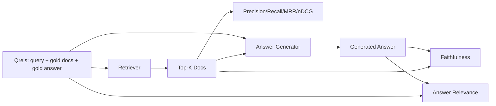

# RAG 评估：Precision、Recall、MRR、nDCG、Faithfulness、Answer Relevance

> 如果你不能同时评估检索质量和答案质量，那这个系统就不能上线。这两者不是同一个指标，而且同一个 prompt 会在不同维度上以不同方式失败。

**Type:** 构建
**Languages:** Python
**Prerequisites:** 第 11 阶段第 06 课（RAG）、10 课（evaluation）；第 19 阶段 Track B 基础（第 20-29 课）；第 19 阶段第 64、65、66、67 课
**Time:** 约 90 分钟

## 学习目标
- 基于 gold qrels 计算四个检索指标：precision@k、recall@k、MRR（mean reciprocal rank）和 nDCG@k。
- 计算两个答案层面的指标：faithfulness（答案中的每个 claim 是否都能在检索上下文中找到依据）和 answer relevance（答案是否真正回应了问题）。
- 构建一个 fixture qrels 文件，包含 queries、gold doc ids 和 gold answer text，并让评估从头到尾读取它。
- 学会通过这些指标判断 pipeline 到底是检索、排序、生成还是 grounding 环节出了问题。

## 问题

一个 RAG 系统至少有四个关键部件：chunker、retriever、reranker、generator。任何一个环节都可能导致错误答案。如果没有分阶段指标，你就是在盲飞。

用户报告了一个错误答案。是因为 chunker 把答案 span 切断了吗？是因为 retriever 根本没把这块 chunk 放进 top-k 吗？是因为 reranker 把正确 chunk 从第一名推下去了？还是因为 generator 明明拿到了正确 chunk，却没理它、自己胡编了内容？光看最终答案，你判断不出来。你需要：

- 检索指标，用来评估 retriever 实际返回了什么。
- 排名指标，用来评估正确 chunk 在结果列表里的位置。
- faithfulness，用来评估 generator 是否忠实地停留在检索上下文里。
- answer relevance，用来评估这段答案到底有没有回答问题。

这一课会在一个 fixture qrels 文件之上，把这六个指标全部搭出来。评估是离线且确定性的；到了生产环境，你只需要把 mock 的 LLM-as-judge 换成真实模型。

## 概念



### Precision@k

retriever 返回的 top-k 文档里，有多少比例属于 gold set？如果 gold 里有三篇文档，而 top-3 命中了其中两篇、另外一篇是错的，那么 precision@3 就是 2 / 3。当“多拿到一个无关 chunk 的代价很高”时，precision 特别重要，例如 generator 会被这些无关 chunk 浪费 token，或者反而被带偏答案。

### Recall@k

gold 文档里，有多少比例出现在 top-k 里？如果 gold 有三篇文档，而 top-5 把三篇都找到了，那么 recall@5 就是 1.0。当“漏掉答案”的代价更高时，就应该关注 recall，也就是宁愿多看到一个错 chunk，也不能把真正的答案 chunk 完全漏掉。

在生产 RAG 里，人们最常引用的通常是 recall@k。因为 generator 很容易忽略不相关的 chunk，但它永远不可能凭空回答一个自己从未见过的 chunk 里的信息。

### MRR（Mean Reciprocal Rank）

对每个查询，找到排序列表里第一个相关文档的位置。它的 reciprocal rank 是 1 / position。再对所有查询求平均。MRR 是一个单值指标，用来概括 retriever 把最佳答案放到列表顶部的能力。

MRR 对 rank 1 的权重非常高。一个查询如果 gold doc 在第 1 位，就贡献 1.0；在第 2 位，贡献 0.5；在第 10 位，只贡献 0.1。它本质上是一个被列表头部强烈主导的指标。

### nDCG@k

Normalized Discounted Cumulative Gain。完整公式会先给每篇文档一个 gain，通常相关文档是 1，不相关是 0；也可以使用分级相关性。然后按位置的对数做折扣，累加之后，再除以理想排序情况下的 DCG，也就是 IDCG。结果范围在 0 到 1 之间。

nDCG 的好处在于能处理 graded relevance，例如 gold 可以写成 “doc A 是 3，doc B 是 2，doc C 是 1”。MRR 和 recall@k 会把这些都压平成二元判断。对于“一个查询对应多篇部分相关文档”的语料，nDCG 更合适。

### Faithfulness

对生成答案里的每个 claim，检查它是否能被检索上下文支持。标准实现通常会使用一个 LLM-as-judge prompt，输入是 (claim, context)，输出 yes 或 no。最后的指标就是“通过的 claim 占总 claim 的比例”。

faithfulness 用来抓 generator 的典型故障模式，也就是模型自己编内容。即便 retriever 已经把正确 chunk 找回来了，只要 generator 还会 hallucinate，这个系统就依然是坏的。faithfulness 也常被叫作 groundedness、support、attribution。

这一课会用一个确定性的 mock judge 来实现 faithfulness：它检查每个 claim 的 token 与检索上下文之间的重叠是否超过阈值。生产环境里只需要换成真实模型调用，指标的整体形状不变。

### Answer relevance

faithfulness 问的是：“这段答案能不能在上下文里找到依据？” answer relevance 问的是：“这段答案到底有没有回应问题？” 一段忠实但跑题的答案，在 faithfulness 上会很高，在 relevance 上却会很低。反过来，一段简短、切题但完全忽略上下文的答案，会在 relevance 上很高，在 faithfulness 上很低。

标准实现同样会使用 LLM-as-judge：输入 (question, answer)，判断这段答案是否真正回应了问题。这一课则提供一个 token-overlap-plus-judge 的替代实现。

## Fixture qrels

```python
{
  "qid": "q1",
  "query": "what is the abort threshold for multipart uploads",
  "gold_doc_ids": ["d1", "d3"],
  "gold_answer_substring": "three failed parts",
  "graded_relevance": {"d1": 3, "d3": 2},
}
```

每条 query 都包含：
- 查询字符串。
- 一组 gold doc ids，用于计算 precision / recall / MRR。
- 一份 graded relevance 字典，用于计算 nDCG。
- gold_answer_substring，作为参考元数据保留在 qrel 中；本课里的 faithfulness 是通过比较提取出的 claims 与检索上下文是否匹配来计算的，而不是直接对这个 substring 打分。

在生产环境里，这些都需要人工标注。这一课则直接附带一份手工构造好的 fixture，让评估开箱即跑。

```figure
ci-rag-metric-ladder
```

## 动手实现

`code/main.py` 会实现：

- `precision_at_k(retrieved, gold, k)`：precision@k 的直接定义。
- `recall_at_k(retrieved, gold, k)`：recall@k 的直接定义。
- `mean_reciprocal_rank(retrieved_list_of_lists, gold_list)`：对整个查询集取平均的 MRR。
- `ndcg_at_k(retrieved, graded_relevance, k)`：支持二元或分级 gain 的 DCG / IDCG。
- `extract_claims(answer)`：把答案拆成近似句子的 claims。
- `faithfulness(claims, context_texts, judge)`：被 judge 判定为 supported 的 claims 占比。
- `answer_relevance(question, answer, judge)`：判断答案是否回应问题。
- `MockJudge`：确定性的 token-overlap judge，让评估可以离线运行。
- `evaluate_pipeline(pipeline_fn, qrels, ks)`：负责串起全部指标的 orchestrator。
- 一个 demo：对三种 pipeline 变体，即 chunker baseline、hybrid retrieval、hybrid + rerank，分别跑 qrels，并打印出一张指标表。

运行方式：

```bash
python3 code/main.py
```

输出会在一张统一的 metrics table 里展示每种变体的 precision@k、recall@k、MRR、nDCG@k、faithfulness 和 answer relevance。hybrid retrieval 那一行会在 recall 上优于 chunker baseline；而 rerank 那一行会在 MRR 上优于 hybrid。

## 如何通过指标诊断故障

| 症状 | 可能原因 | 应该修什么 |
|---------|-------------|-------------|
| low recall@k, low precision@k | chunker 把答案切断了，或 retriever 根本找不到它 | chunker 边界（第 64 课）或 retriever 模态（第 65 课） |
| decent recall@k, low MRR | 正确 chunk 进了 top-k，但没排到第 1 位 | reranker（第 66 课） |
| high MRR, low faithfulness | generator 明明拿到正确上下文，却还在编内容 | generation prompt；强制 cite-or-refuse |
| high faithfulness, low relevance | 答案有依据，但跑题 | query rewriter（第 67 课）或 generation prompt |
| 四项都高，用户仍然抱怨 | eval set 不具代表性 | 用真实用户查询扩展 qrels |

## Demo 不会暴露出来的失败模式

**LLM-as-judge 会有偏差。** 模型会把自己生成的输出判得比实际更忠实。解决办法是让 judge 与 generator 使用不同模型家族，或者人工抽样复核。

**Qrels 会腐烂。** 语料库变化后，gold answers 也会漂移。2024 年 1 月里 q1 的 gold doc，到 2024 年 10 月可能已经不对了，因为团队重命名了函数。应该按季度做 qrels 审查。

**Faithfulness 的微观检查会漏掉宏观误导。** 逐句 faithfulness 可能全部通过，但整体答案结构仍然会误导读者。自动化指标之上，还需要加一层样本级的定性复核。

**Recall@k 会掩盖单类查询的系统性失败。** 平均 recall 90% 可能掩盖了某一类查询总是失败。应该按 query class 对 qrels 切片，例如 literal、paraphrased、multi-topic，并分别报告每个切片的指标。

## 用它

生产环境里的常见模式包括：

- 每次 retriever 或 generator 改动后都跑评估。把 recall@k 回归当成测试失败处理。
- 为每个查询保留完整的 metric trace。用户抱怨时，直接查匹配的 qrels 项，确认这个问题本来能不能被抓出来。
- 给 qrels 分层：一个 20 条查询的 smoke set 跑在 CI；一个 200 条查询的 regression set 每晚跑；一个 2000 条查询的 deep set 每周跑。

## 交付它

第 69 课会把整个 pipeline，即 chunker、retriever、reranker、generator，完整串起来，并在端到端系统上运行这一套评估。

## 练习

1. 再加一个第五类检索指标：hit-rate@k。把它和 recall@k 做比较，并解释它们何时不同。
2. 实现 graded faithfulness：0 表示 unsupported，1 表示 partially supported，2 表示 fully supported，并相应更新指标。
3. 用真实模型调用替换 mock judge。测量它与 mock judge 在 fixture 上的分歧程度。
4. 增加 query-class 切片，例如 “literal”“paraphrased”“multi-topic”，并输出分切片指标。
5. 增加一个 “answer length” 指标，并分析它与 faithfulness 之间的相关性，画出曲线。

## 关键术语

| 术语 | 常见说法 | 实际含义 |
|------|-----------------|------------------------|
| Precision@k | "已检索结果里的命中率" | top-k 结果中有多少比例属于 gold |
| Recall@k | "gold 集合里的命中率" | gold 文档中有多少比例出现在 top-k |
| MRR | "首个命中的位置" | 第一个相关文档的 1 / rank 在所有查询上的平均值 |
| nDCG@k | "分级排序质量" | top-k 的 DCG 除以理想排序下的 DCG |
| Faithfulness | "有据可依性" | 答案中的 claims 有多少能被检索上下文支持 |
| Answer relevance | "它真的回答了问题吗？" | 答案是否真正对准了问题意图 |
| Qrels | "Gold labels" | 带标注的查询集合，以及对应的 gold 文档和答案 |

## 进一步阅读

- Buckley, Voorhees, "Evaluating Evaluation Measure Stability", SIGIR 2000 - 排名指标领域的经典论文
- Jarvelin, Kekalainen, "Cumulated Gain-based Evaluation of IR Techniques" - nDCG 论文
- [Ragas: RAG 流水线自动化评测](https://docs.ragas.io)
- [Anthropic, Evaluating RAG](https://www.anthropic.com/news/evaluating-rag)
- 第 11 阶段第 10 课 - evaluation framework foundations
- 第 19 阶段第 64-67 课 - components evaluated here
- 第 19 阶段第 69 课 - the end-to-end pipeline this eval grades
