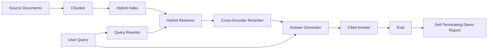

# 端到端 RAG 系统

> 六节组件课。一条 pipeline。一轮 eval。一个会自行结束的 demo。这才是你真正要交付的系统。

**Type:** 构建
**Languages:** Python
**Prerequisites:** 第 11 阶段第 06 课（RAG）、10 课（evaluation）；第 19 阶段 Track B 基础（第 20-29 课）；第 19 阶段第 64、65、66、67、68 课
**Time:** 约 90 分钟

## 学习目标
- 把 chunker、hybrid retriever、query rewriter、cross-encoder reranker 和 answer generator 组装成一条完整的端到端 pipeline。
- 实现一个会按 chunk anchor 引用证据的 answer generator，并在低置信度时回退到 refuse。
- 把第 68 课的 eval 跑在这条完整 pipeline 上，证明分阶段构建出来的系统，在每个指标上都优于把同样组件孤立演示的结果。
- 构建一个会自行结束的 CLI demo：读入 fixture corpus，运行固定查询集，最终输出 summary report，并以 0 退出。

## 问题

六个彼此孤立的组件，并不能证明系统真的成立。chunker 可能在单独测试中拿到更高的 recall@5，却在系统里的 recall@5 反而变差，因为 retriever 根本排不好它切出来的 chunk。reranker 可能在合成 candidate pool 上提升了 MRR，但换到真实 bi-encoder 提供的 candidates 后就失败，因为 bi-encoder 在 rerank budget 下的 recall 太低。query rewriter 可能在某一个查询上成功把 gold doc 顶上来，但下一个查询就失效，因为 LLM mock 返回了一个退化的 hypothetical。

真正的集成测试，必须是整条 pipeline 在同一份 fixture qrels 上端到端跑完，使用同样的指标，由同一个 orchestrator 文件把一切串起来。这就是这节课要构建的东西。如果集成后的 pipeline 指标优于每个阶段单独 demo 时的指标，你才能说系统被证明了。

## 概念



### 组装方式

这条 pipeline 本质上是一个小图，每个 stage 都是一个签名清晰的函数。

| 阶段 | 输入 | 输出 |
|-------|-------|--------|
| 分块器（Chunker） | 文档文本 | Chunk 记录列表 |
| 检索器（Retriever） | 查询字符串 | Top-N Chunk 记录 |
| 改写器（Rewriter，可选） | 查询字符串 | 改写结果与假设文档列表 |
| 重排器（Reranker） | 查询、候选项 | 带交叉编码器评分的 Top-K Chunk 记录 |
| 生成器（Generator） | 查询、Top-K Chunk 记录 | 带引用的答案字符串 |

只要每个 stage 的签名稳定，组合起来就很直接。这节课里的 `Pipeline` 类持有这五个阶段，并暴露一个 `query` 方法，按顺序执行它们。每个 stage 都是可替换的：你可以换一个不同的 chunker、retriever、rewriter、reranker 或 generator，而整个 pipeline 仍然能跑。

### 带引用的答案生成器

generator 是最后一个阶段，也是最容易出问题的阶段。课程里附带了一个确定性的 mock generator，它会：

1. 接收 top-K 的 reranked chunks。
2. 选出最多两个与 query 有最高内容词重叠的 chunks。
3. 从每个被选中的 chunk 中取一句话，把它们拼成答案，并在每句后面加上一个 `[doc_id:chunk_index]` anchor。
4. 如果没有任何 chunk 的重叠度超过 refuse threshold，就输出 “I do not know”，而且不附 citation。

在生产环境里，你会把这个 mock 换成真实的 LLM 调用，prompt 模板如下：

```
You are answering a question using only the snippets below.
Cite every claim with the anchor in parentheses.
If the snippets do not answer the question, say "I do not know".

Question: {query}

Snippets:
{enumerated chunks with anchors}

Answer:
```

之所以要记录 cross-encoder 的 rank-1 score，就是为了支持这个 refuse-on-low-confidence 路径。如果这个分数低于语料库阈值，generator 就直接拒答。这是抵御幻觉答案的安全阀。

### 会自行结束的 demo

这个 demo 会把整条 pipeline 从头到尾跑一遍。它会打印某个查询的逐阶段 trace，对四条 fixture qrels 跑 eval，输出一张 metrics table，然后在第 68 课的所有指标都达到 demo 设定阈值时，以状态码 0 退出。如果有任何指标低于阈值，demo 就会以非零状态退出，并明确指出是哪个指标没过线。

这基本就是一个 CI smoke test 的标准形状：离线、快速、确定性。这里的阈值在 fixture 上故意设得比较紧，这样只要前面六节课中的任意一个组件发生回归，demo 就会失败。

```figure
rag-pipeline-flow
```

## 动手实现

`code/main.py` 会实现：

- `Chunk`：贯穿全部 stages 的记录结构，在第 64 课的基础上增加 chunk_index 和源 doc_id。
- `Chunker`：从第 64 课的策略里选择一种，默认是 recursive split。
- `HybridIndex`：封装第 65 课里的 BM25 + dense + RRF。
- `Rewriter`（可选）：基于 query length 和 conjunctions，按第 67 课的方法在 HyDE、多查询、分解之间做选择。
- `Reranker`：第 66 课里的 cross-encoder，这里会用更小的 fixture training set，让它在几秒内收敛。
- `Generator`：带 citation 和 refuse-on-low-confidence 的确定性 mock generator。
- `Pipeline`：把这五个阶段组装起来，并提供 `query(question)` 方法，返回 `Result(answer, top_k, latency_ms_per_stage)`。
- `run_demo()`：读入 corpus，跑三条 fixture queries，执行 eval，打印结果，并按阈值设置退出码。

运行方式：

```bash
python3 code/main.py
```

输出包括一条打印出来的 query trace、完整的 eval table，以及最后的 pass/fail 状态。在 fixture 上应返回退出码 0。

## Demo 会掩盖的失败模式

**Chunker boundary drift。** 如果你在标注 eval qrels 时用的是一种 chunker 策略，demo 里又换成了另一种，那么 gold doc ids 就不再对齐。正确做法是把 chunker 策略锁进 qrels 文件里。demo 的 header 也会显式打印出当前使用的 chunker。

**Reranker training set 泄漏到 eval。** 第 66 课里的 14 条训练 triples 里，有些查询与 eval queries 很像。生产环境里，eval queries 必须严格 hold out。这个 demo 中的 eval queries 是故意与 rerank training set 分离开的。

**Mock generator 会掩盖幻觉风险。** 这个 mock 不会 hallucinate，因为它只能输出来自 retrieved chunks 的原文句子。课程会明确指出这一点，并说明生产环境的替换路径应该切到真实模型。

**没有 streaming。** 这条 pipeline 会在每个 stage 完成后返回完整结果。生产系统通常会流式输出 generator 的结果。streaming 不在本课范围内；无论是否流式，答案级指标最终都还是在完整字符串上计算。

**Latency 是离线的。** mock LLM 调用的时间基本恒定，真正占主导的会是真实 LLM 调用。生产环境里需要在 request scope 内单独规划 latency budget；本课的分阶段 timing 只测 CPU 工作。

## 用它

生产环境里的常见模式包括：

- 把整个 pipeline 文件收敛到一个 orchestrator 下，并显式定义各 stage interface，不要把 wiring 分散到仓库各处。
- 每次有 stage 被改动时都重新跑 eval。只要指标掉了，这个 merge 就不能落地。
- 为每次 CI run 保存 metric trace，这样 stage 被替换后，回归能明确归因。
- 准备一个 20 条查询的 smoke set，它是 regression set 的子集，能在 30 秒内跑完；完整 regression set 则放到 nightly。

## 交付它

这一课中的 pipeline 文件，会成为 Phase 19 Track F 后续课程默认承接的形状。后面的课程可以继续往上叠 ingestion automation、incremental re-index、telemetry 和 serving layer。retrieval、rerank、rewrite 和 eval 这些关键部分，到这里已经齐了。

## 练习

1. 在 rewriter 内增加一个 per-query strategy selector：使用第 67 课里的启发式规则，如长度、连接词、术语密度，在 HyDE、多查询和分解之间选择。
2. 在 env flag 后面给 generator 加一个真实 LLM 调用，默认仍使用 mock。测量两者的延迟差。
3. 扩展 demo，支持 `--corpus path` 参数去加载真实 corpus，然后重新跑 eval 和阈值检查。
4. 给 chunker 增加一个 `--strategy` 参数。测量每种策略对端到端 recall 的贡献。
5. 增加一个 streaming generator interface，并把它接进 eval。确认 faithfulness 仍然只在最终字符串上计算，而不是对流式前缀计算。

## 关键术语

| 术语 | 常见说法 | 实际含义 |
|------|-----------------|------------------------|
| Pipeline | "RAG pipeline" | 从 ingestion 到 cited answer 的完整组合式阶段链 |
| Citation anchor | "Source link" | 附在每个 claim 后面的 (doc_id, chunk_index) 引用锚点 |
| Refuse-on-low-confidence | "I do not know" | 当 reranker 的 top-1 score 低于阈值时，generator 直接不给答案 |
| Smoke set | "CI eval" | 每个 PR 检查都会运行的最小 qrels 子集 |
| Stage interface | "Function signature" | 每个 pipeline stage 稳定的输入和输出类型 |

## 进一步阅读

- [Anthropic, 构建搜索与检索](https://www.anthropic.com/news/contextual-retrieval)
- [Pinterest, MCP internal search](https://medium.com/pinterest-engineering) - 参考生产架构
- [Ragas: RAG 流水线自动化评测](https://docs.ragas.io)
- 第 11 阶段第 06 课——RAG 基础
- 第 19 阶段第 64-68 课——本课组合使用的组件
