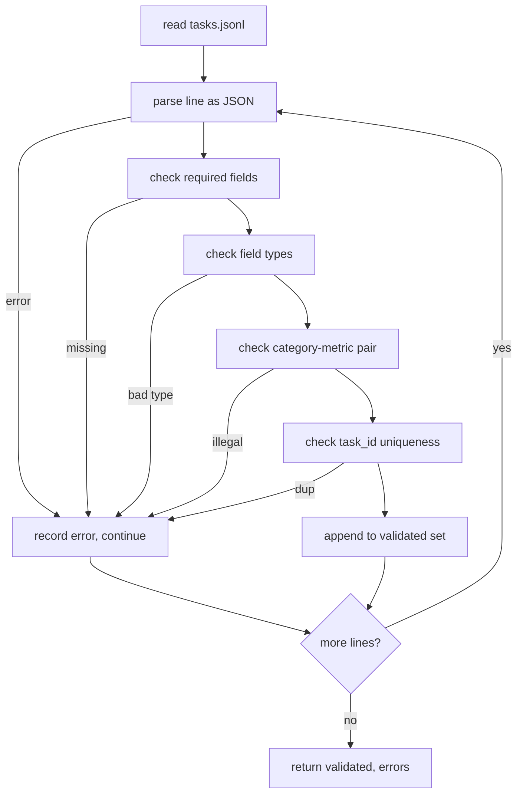

# 任务规格格式

> 一个 eval harness 的上限，取决于它所执行任务遵守的契约有多严。先冻结 JSONL 的记录形状，再冻结 metric vocabulary，然后才谈得上写哪怕一个 scoring function。

**Type:** 构建
**Languages:** Python
**Prerequisites:** 第 19 阶段 Track B 基础课
**Time:** 约 90 分钟

## 学习目标

- 定义一套统一的 JSONL 任务记录 schema，用一个形状同时覆盖 arithmetic、multiple-choice、code execution、classification 和 free-text summarisation。
- 固定一组封闭的 metric names，让后续课程（71-73）都能只靠一个字段完成分发。
- 把 few-shot examples 和 post-processing rules 定义成 task 自身的一部分，而不是 runner 的隐式行为，这样同一个 prompt 在不同模型上也能对应同一个 target。
- 实现一个严格的 validator，在任务进入 runner 之前就拒绝掉所有不合法记录。
- 提供一组 10 条任务的 fixture，覆盖 spec 的每个分支，让 validator 真正有东西可验证。

```figure
ci-task-spec-gate
```

## 为什么要冻结 spec

研究型代码库积累 eval scripts 的速度，通常比积累测试更快。六个月之后，每个 notebook 都有自己的一套 JSON 结构，每个 metric 都被重复实现两遍，跑出来的结果还互相没法比较。修复方法其实很朴素：选一个 schema，写一个 validator，其余形状一律拒绝。这就是这一课要做的事。

这个形状借鉴了 BIG-bench、HELM 和 lm-eval 一类 harness 的思路，但字段名是我们自己的。每个字段都有单一职责。runner 只读 task。metric 只读 targets。post-process 只负责规范化 generation。没有任何字段会在 pipeline 中途被随意修改。

## 记录形状

一个 task 就是 JSONL 文件中的一行 JSON object。harness 读取 `tasks.jsonl`，并独立验证每一行。某一行坏掉，只会中止这条记录，不会直接让整次运行崩掉。

```json
{
  "task_id": "arith_001",
  "category": "arithmetic",
  "prompt": "Compute the result. Question: 17 + 24\nAnswer:",
  "targets": ["41"],
  "metric_name": "exact_match",
  "few_shot_examples": [
    {"prompt": "Question: 2 + 2\nAnswer:", "completion": "4"}
  ],
  "post_process": "strip_whitespace",
  "metadata": {"difficulty": "easy"}
}
```

必填字段是 `task_id`、`category`、`prompt`、`targets`、`metric_name` 和 `post_process`。`few_shot_examples` 与 `metadata` 是可选字段。任何未知的顶层字段都会导致验证失败。

## 字段规则

`task_id` 必须是不含空白字符的字符串。validator 还会检查整个文件里它是否唯一。

`category` 只能取 `arithmetic`、`mcq`、`code_exec`、`classification`、`summary` 之一。category 会约束哪些 metric 与 post-process 组合是合法的。例如，`code_exec` 任务必须使用 `metric_name = code_exec`，而 `mcq` 任务必须使用 `metric_name = exact_match`，并且 target 必须是单个字母。

`prompt` 必须是非空字符串。validator 会拒绝带尾随空白的 prompt，也会拒绝那些已经把 few-shot block 直接写进 prompt 正文里的记录。few-shot 的拼接应该由 runner 来完成，而不是由任务作者手工写死。

`targets` 必须是一个非空字符串列表。对 `exact_match` 来说，只要其中任意一个元素匹配就算通过。对 `f1` 和 `rouge_l` 来说，则取与所有 targets 比分时的最高分。对 `mcq` 而言，列表里必须恰好只有一个元素。

`metric_name` 只能取 `exact_match`、`f1`、`bleu_4`、`rouge_l`、`accuracy`、`code_exec` 之一。这是一个封闭词表。要引入新 metric，必须通过新的课程和这里的新条目来完成。

`few_shot_examples` 是由 `{prompt, completion}` 组成的列表。validator 会把长度限制在 8 条以内，避免 prompt 无限膨胀。

`post_process` 只能取 `none`、`strip_whitespace`、`lower`、`extract_letter`、`extract_code_block`、`extract_first_line` 之一。每条规则都只有一种确定性行为。validator 不允许组合多个规则。

## Validator 行为



validator 会返回两个列表：validated records，以及 error records。错误记录里会包含出错的行、违反的规则以及对应字段。如果 error list 非空，runner 默认拒绝启动，除非显式传入 `--allow-bad-tasks`。

## Few-shot 渲染

runner 会把 few-shot examples 按空行分隔，拼接在 prompt 前面。每个模型都走同一条代码路径，因此唯一的方差来源是模型本身。作者只写一次 examples，而不是每接一个 provider 就重写一遍。

```python
def render(task):
    parts = []
    for ex in task.get("few_shot_examples", []):
        parts.append(ex["prompt"] + " " + ex["completion"])
    parts.append(task["prompt"])
    return "\n\n".join(parts)
```

## 后处理规则

post-process 发生在 generation 之后、metric 之前。它必须是确定性的、无状态的。

- `none`：原样返回字符串。
- `strip_whitespace`：去掉首尾空白。
- `lower`：把字符串转成小写。
- `extract_letter`：返回第一个匹配 `[A-E]` 的字符，用于 MCQ。
- `extract_code_block`：返回第一个三反引号 fenced code block 的主体，用于 code-exec。
- `extract_first_line`：返回第一条非空行，用于 summary classification。

如果某个任务需要超出这份列表之外的规则，那它就应该属于一节新课，而不是偷偷往现有 spec 里塞特例。

## 这一课不做什么

它不负责评分。不调用模型。不运行代码。这些内容会在第 71、72 和 75 课中处理。这一课只负责冻结后续所有模块都必须遵守的契约。

那组 10 条 fixture tasks 包含两条 arithmetic、两条 MCQ、两条 code-exec、两条 classification 和两条 summarisation。validator 必须能在这 10 条上全部通过。另一份单独的 fixture，也就是 `tasks_bad.jsonl`，会刻意触发每一条规则，而 validator 应该返回完全对应数量的错误。

## 如何阅读代码

`main.py` 定义了 `TaskSpec`、`validate_task`、`validate_file` 以及 CLI entry point。fixture loader 叫 `load_fixtures`。render 与 post-process helpers 则与 validation 写在一起，这样第 75 课里的 runner 只需要 import 一个模块。

先从头到尾读 `main.py`，再去看 `code/tests/test_spec.py`。测试会把每条验证规则与每条 post-process 行为都钉死。`main.py` 底部的 demo 会验证随课程打包的 fixture，并打印一段 summary。

## 继续往前走

真实的 eval suites 会像 schema 扩列一样不断长出新 category。比较稳妥的做法，是拒绝添加任何 category，除非它同时带来一个 metric、一条 post-process rule，以及至少一条 fixture task。把 spec 当成数据库迁移来管理：每次变更都要被审查、版本化，并配套测试。这一课里的 validator，就是守住这道门的 gate。
