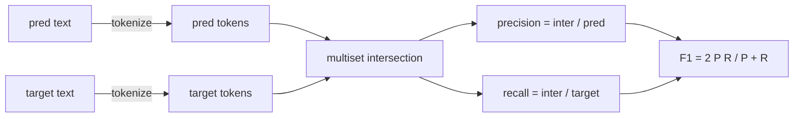
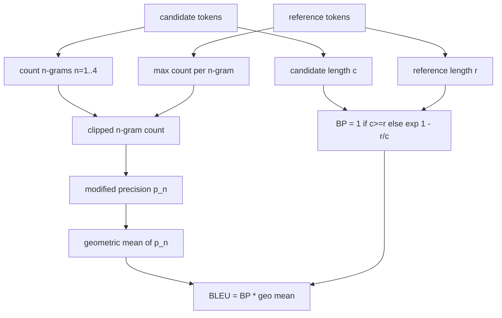

# 经典指标

> BLEU、ROUGE-L、F1、exact-match、accuracy。这五个指标，至今仍覆盖了大多数公开发表的 LLM eval 数字。把它们从第一原则实现一遍，你才会真正知道一个分数到底代表什么。

**Type:** 构建
**Languages:** Python
**Prerequisites:** 第 19 阶段 Track B 基础课，第 70 课
**Time:** 约 90 分钟

## 学习目标

- 按明确的 tokenisation 规则，实现 token-level exact-match、F1 和 accuracy。
- 从零实现 BLEU-4：modified n-gram precision、从 n = 1 到 4 的几何平均，以及 brevity penalty。
- 用 longest common subsequence 实现 ROUGE-L，并通过 F-beta 组合 precision 与 recall。
- 依据第 70 课的 metric_name 字段做分发，让 runner 本身保持 metric-agnostic。
- 用手工推导出来的 reference vectors 固定行为，而不是依赖第三方库。

```figure
cd-bleu-overlap
```

## 为什么要自己实现

你会读到一篇论文报告 BLEU 28.3，另一篇却报告 BLEU 0.283。你还会看到两个库算出来的 ROUGE-L 差十个点，只因为一个库在打分前先 lower 了，另一个没有。最快摆脱困惑的方式，就是自己把指标写出来，然后明确指出“tokenizer 在哪一行决定”“smoothing 在哪一行发生”。做到这一步之后，比较不同论文的数字就不再是跟库争论，而是读懂它们的 metric setup。

stdlib 加上 numpy 就足够了。BLEU 本质上是计数加截断。ROUGE-L 本质上是动态规划。F1 本质上是 tokens 的交集。最难的部分其实只是：选定一个 tokenizer，并且真的坚持它。

## 分词规则

分词器固定为 `re.findall(r"\w+", text.lower())`。也就是先转成小写，只保留字母数字连续段，丢掉标点。这一课的所有指标都必须使用这一套分词器。runner 没有选择权。只要你换了分词器，你跑的就已经不是同一个 benchmark。

```python
TOKEN_RE = re.compile(r"\w+", re.UNICODE)
def tokenize(text):
    return TOKEN_RE.findall(text.lower())
```

这是一种有意的简化。生产环境会在乎 CJK、缩写和代码标识符。但这节课的重点是：分词器是契约，不是旋钮。

## 精确匹配

```python
def exact_match(pred, targets):
    return float(any(pred.strip() == t.strip() for t in targets))
```

它对每条 task 返回 1.0 或 0.0。数据集上的整体结果就是均值。这是 arithmetic、MCQ 和短分类任务最常用的主力指标。

## 词元级 F1

先构造 prediction 与 target 的 token multiset。precision 等于 multiset intersection 除以 prediction 的 multiset 大小。recall 等于同一个 intersection 除以 target 的 multiset 大小。F1 则是二者的调和平均数。实现里还要正确处理空 prediction 与空 target 的边界情况。



对于多目标任务，我们取 target 列表中的最佳 F1。这与文献里广泛采用的 SQuAD 风格行为一致。

## BLEU-4

BLEU 是机器翻译领域的经典指标，现在在 summarisation 任务中仍然经常出现。这里采用的是 corpus-level BLEU-4，带标准 brevity penalty，并在 modified n-gram counts 上使用 additive-one smoothing，这样即使缺失一个 4-gram，也不会让分数直接掉成 0。

对每个 candidate-reference 对，我们会计算 n = 1、2、3、4 的 modified n-gram precision。所谓 modified precision，就是把 candidate 的 n-gram 计数裁剪到“该 n-gram 在任一 reference 中出现的最大次数”，这样 candidate 就不能靠重复一句话来虚增分数。四个 precision 的几何平均，再乘上 brevity penalty，就得到 BLEU。



这里使用的 smoothing 规则，就是 Lin 和 Och 所谓的 method 1：在每个 n-gram precision 的 numerator 和 denominator 上都加一，再去取 log。这样可以避免当 reference 没有匹配的 4-gram 时出现 `log 0`，同时在长 candidate 上又不会偏离 unsmoothed 值太远。

## ROUGE-L

ROUGE-L 比较的是 candidate 与 reference token 序列之间的 longest common subsequence。LCS 能保留词序信息，但不要求必须连续，所以它会成为 summarisation 中的默认指标。我们会先用一个标准动态规划表算出 LCS 长度，再把 recall 定义成 `lcs / reference length`，precision 定义成 `lcs / candidate length`，最后用 F-beta 组合；这里 beta 取 1，也就是对称的 F1 形式。

```python
def lcs_length(a, b):
    n, m = len(a), len(b)
    dp = numpy.zeros((n + 1, m + 1), dtype=int)
    for i in range(n):
        for j in range(m):
            if a[i] == b[j]:
                dp[i+1, j+1] = dp[i, j] + 1
            else:
                dp[i+1, j+1] = max(dp[i+1, j], dp[i, j+1])
    return int(dp[n, m])
```

这里用 numpy 表只是为了代码更直观；纯 Python list 也能写。对 opt into ROUGE-L 的任务来说，它要支付每条 task 一个 O(n m) 的成本。但对常见的 summary 长度而言，这个代价通常仍然在毫秒级以内。

## Accuracy

对多目标分类任务来说，accuracy 本质上会退化成对单个规范化 target 的 exact-match。之所以单独暴露一个函数，是为了让 dispatcher 能直接按 `metric_name` 分发，而不必在 runner 内部写一堆字符串特判。

## 分发契约

统一入口是 `score(metric_name, prediction, targets)`。它返回一个落在 `[0, 1]` 区间内的 float。runner 自己不对 metric name 分支，只负责把调用交出去，再写回结果。这就是第 75 课会与第 70 课 task spec 粘合起来的那个接口面。

```python
def score(metric_name, pred, targets):
    if metric_name == "exact_match":
        return exact_match(pred, targets)
    if metric_name == "f1":
        return max(f1_score(pred, t) for t in targets)
    if metric_name == "bleu_4":
        return max(bleu4(pred, t) for t in targets)
    if metric_name == "rouge_l":
        return max(rouge_l(pred, t) for t in targets)
    if metric_name == "accuracy":
        return accuracy(pred, targets)
    raise ValueError(f"unknown metric_name: {metric_name}")
```

`code_exec` 会在第 72 课中补进来，并在那一课接入这个 dispatcher。

## 这一课不做什么

它不调用模型。不做超出第 70 课 post-process 规则之外的 generation 规范化。不计算 confidence intervals。也不处理 BLEURT 或 BERTScore 这类需要模型支持的指标。那些属于另一节课。这一课只做地板层：五个经典指标、一套分词器、一张分发表。

## 如何阅读代码

`main.py` 里，每个指标都以独立自由函数定义，再加上 dispatcher。参考向量放在文件底部的 `_reference_examples` 区块里。demo 会拿这 8 个例子跑 dispatcher，并打印每个 metric 的分数。`code/tests/test_metrics.py` 会把这些参考向量固定住，并覆盖所有边界情况，例如空 prediction、空 reference、完全没有共享 token、完全精确匹配，以及 repeated phrase clipping。

从头到尾读 `main.py`。这些函数按复杂度排序：exact_match 和 accuracy 都只有一行；F1 只有几行；真正较重的是 BLEU 和 ROUGE-L，而它们在代码里会详细注释 smoothing 规则和 LCS recurrence。

## 继续往前走

经典指标是必要条件，但绝不是充分条件。它们奖励的是表面重叠，却很容易错过语义。下一步应该是在它们上面再叠一层模型型指标，例如 BLEURT、BERTScore、GEval。不过那是后续课程的内容。现在先把这五个指标做对、用测试钉牢，你就已经拥有了一套可审计、快速且可复现的 metric stack。
