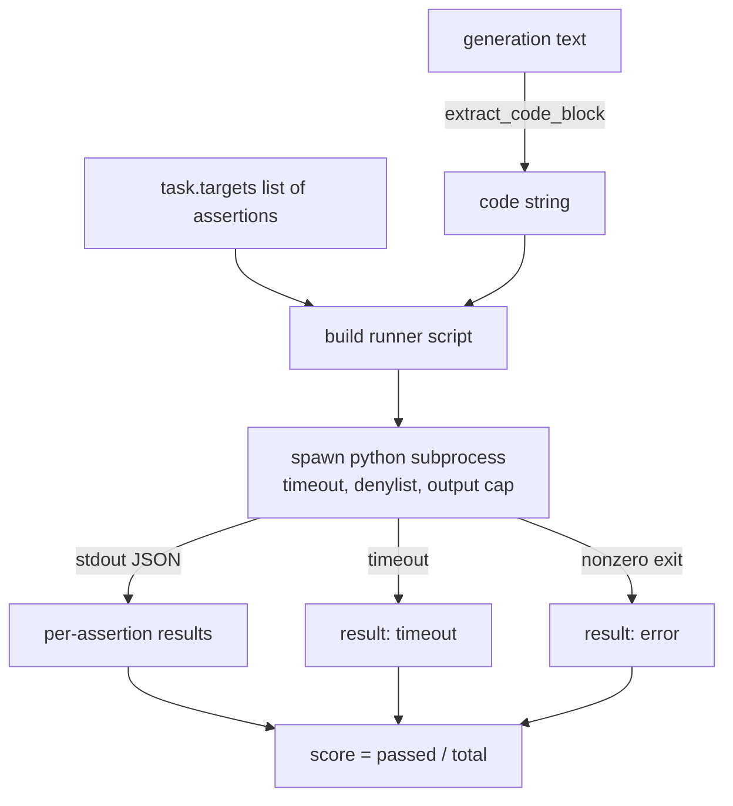
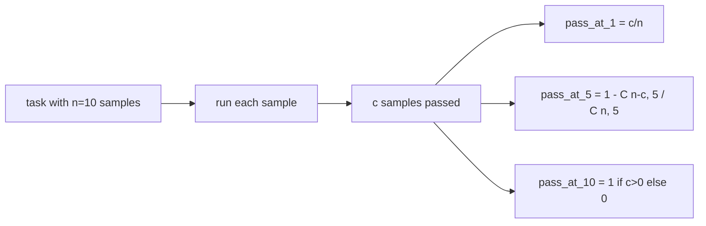

# 代码执行指标

> 生成的代码只有通过测试才算正确。评估框架必须提取代码，在不导致宿主崩溃的情况下运行代码，并如实统计通过率。本课将构建这一层能力。

**Type:** 构建
**Languages:** Python
**Prerequisites:** 第 19 阶段 Track B 基础课、第 70 课与第 71 课
**Time:** 约 90 分钟

## 学习目标

- 按照第 70 课的后处理规则，从自由格式生成内容中提取代码块。
- 在隔离子进程中执行候选代码，并设置挂钟超时、输出上限和导入拒绝列表。
- 以候选代码通过的断言数占给定断言总数的比例作为任务得分。
- 为从同一个模型采样多个生成结果的任务计算 pass-at-k。
- 将沙箱崩溃、语法错误和超时视为一等失败模式，为其提供运行器能够记录的不同退出码。

```figure
sandbox-runner
```

## 为什么要使用隔离子进程

内联 `exec` 会同时危害安全性与稳定性。生成的 `while True: pass` 会让评估永远无法结束；生成的 `import shutil; shutil.rmtree('/')` 则可能造成灾难性后果。解决办法是为每个候选结果启动独立的 Python 解释器，通过 stdin 传入代码，把断言结果写入 stdout，并在运行超时时终止该进程。宿主评估进程可以继续运行。

HumanEval、MBPP、BigCodeBench 与 LiveCodeBench 等真实评估都使用子进程沙箱，有些还会在外层加入 Docker。本课有意止步于子进程：它便于移植、只依赖标准库，也能捕获教学评估中重要的失败模式。生产部署还会增加 seccomp、网络隔离和只读文件系统。下一节关于加固的课程位于本轨道之外。

## 代码执行任务的结构

`code_exec` 任务在 `targets` 中携带断言字符串。运行器从生成内容中提取围栏代码块，围绕它构建测试程序，然后执行。



得分是 `[0, 1]` 区间内的比例。若一项任务包含三个断言，其中两个通过，得分就是 0.667。无论发生哪种故障，运行器都返回相同结构：子进程崩溃会映射为规范化错误码，而不会把 Python 回溯信息抛给评估框架。

## 拒绝列表

拒绝列表按导入模块拦截。运行候选代码前，运行器脚本会把危险模块的导入改写为一个抛出 `ImportError("denied")` 的桩对象。该列表有意采用保守策略：`os.system`、`subprocess`、`socket`、`requests`、`urllib`、`urllib.request`、`urllib.error`、`urllib.parse`、`ctypes`、`shutil`、`http.client`、`asyncio.subprocess`。

这套机制并非无懈可击。精心构造的恶意代码可以逃逸任何 Python 进程内沙箱。拒绝列表只是兜底措施；真正负责约束资源的是挂钟超时与输出上限。

```python
DENIED = {
    "os.system": True,
    "subprocess": True,
    "socket": True,
    "shutil": True,
    "requests": True,
    "urllib": True,
    "ctypes": True,
}
```

我们会在候选代码前添加 `import sys` 和一段防护代码，通过猴子补丁让 `os.system` 抛出异常。完整模板位于 `main.py`。

## 挂钟超时

每个子进程默认有三秒的挂钟时间预算。运行器使用 `subprocess.run(..., timeout=t)`。触发超时时，运行器会捕获 `TimeoutExpired`、终止进程，并为任务记录 `timeout` 退出原因。该任务得分为零，之后继续处理下一项任务。

可以通过 `task.metadata.timeout_s` 为每项任务配置超时。耗时较长的单元测试可以申请更多时间；第 70 课的验证器将该值限制在三十秒以内，确保整个测试套件有明确上界。

## 输出上限

子进程可能持续向 stdout 写入大量内容，耗尽宿主内存。运行器以流式方式将 stdout 写入缓冲区；累计大小一旦超过 256 KB，就终止子进程。结果记录为 `exit_code = error`，详细信息字符串为 `"output overflow"`。生成代码意外进入不断打印的无限循环时，就会出现这种情况。

## Pass-at-k 指标

Pass-at-k 是 HumanEval 等评估使用的无偏估计量。给定每项任务的 `n` 个独立样本，其中 `c` 个通过，当抽样规模为 `k`、且这些样本取自前述 `n` 个样本时，至少包含一个通过方案的概率为：

```
pass_at_k(n, c, k) = 1 - C(n - c, k) / C(n, k)
```

当 `n - c < k` 时，分子未定义，此时取值为 `1`。实现会直接处理这个边界情况。我们公开 `pass_at_k(n, c, k)`，供第 74 课的 Leaderboard 层使用。



## 退出码

运行器为每项任务返回以下五种结果之一：

- 所有断言均通过时为 `pass`。
- 代码成功运行但至少一个断言失败时为 `assertion_fail`。
- 代码无法导入或存在 SyntaxError 时为 `syntax_error`。
- 超过挂钟时间时为 `timeout`。
- 其他崩溃均为 `error`，包括命中拒绝列表与输出溢出（溢出时的详细信息为 `"output overflow"`）。

得分仍是比例，退出码则作为元数据保存。后续课程可以自行决定将超时计为零还是缺失数据。

## 本课不做什么

本课不会提供真正的沙箱，不会运行来自开放 Web 的不可信代码，也不处理文件 I/O 或网络调用等有状态任务；这些操作需要容器或 microVM。本课重点在于合约：隔离子进程、拒绝列表、超时、输出上限、清晰的退出码词汇，以及 pass-at-k 数学。

## 如何阅读代码

`main.py` 定义 `extract_code`、`run_candidate`、`score_code_exec` 和 `pass_at_k`。子进程运行脚本以字符串形式构建，再通过 `-c` 传给全新的 Python 解释器。`code/tests/test_exec.py` 中的测试覆盖四种退出码，并用 HumanEval 风格的演算示例验证 pass-at-k。

从头到尾阅读 `main.py`。运行器模板是其中最重要的部分。仔细查看断言循环，直到你能够预测它写回父进程的 JSON 信封。

## 进一步探索

子进程结构能够工作后，下一个问题是可移植性。不同 Python 版本在 Windows 上处理 SIGKILL 的方式不同，最干净的解决方案是把运行器放进 Docker 镜像。再下一步是用真实单元测试文件替换断言字符串，让评估与生产 CI 的行为一致。到了这一步，不要再把断言字符串称为测试；它们只是简化示例，也只覆盖简化场景中的失败模式。
