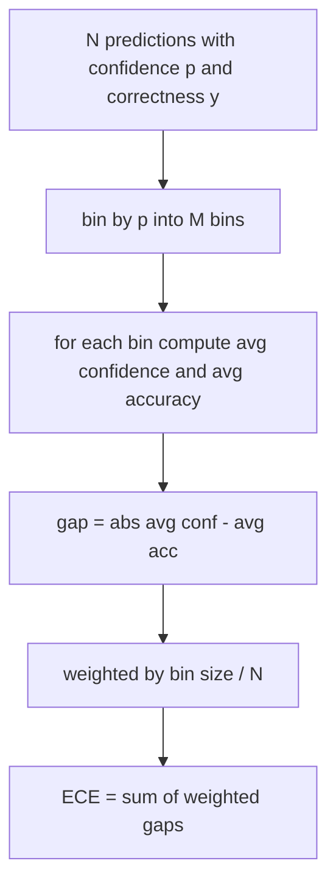
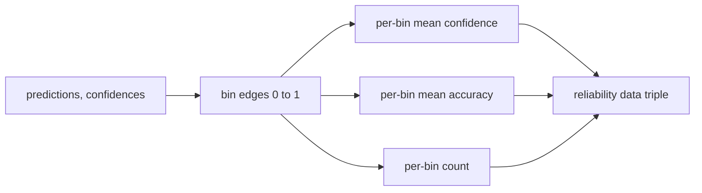

# 困惑度与校准

> 如果模型对一千个答案都声称有 90% 的置信度，结果却只答对六百个，它就没有得到良好校准。校准是可信评估的一半，另一半是困惑度；后者告诉你模型是否认为留出文本本身合理可信。

**Type:** 构建
**Languages:** Python
**Prerequisites:** 第 19 阶段 Track B 基础课、第 70 课与第 71 课
**Time:** 约 90 分钟

## 学习目标

- 根据模型适配器提供的逐 token 负对数概率，计算留出语料库的 token 级困惑度。
- 根据分桶后的预测概率，计算分类器或多项选择评估的期望校准误差（ECE）。
- 计算 Brier 分数（相对正确性指示变量的均方误差），并解释它在哪些方面补充了 ECE。
- 构建绘制“置信度—准确率”曲线所需的可靠性图数据。
- 将三者全部接入评估框架，使运行器能把 `perplexity`、`ece` 和 `brier` 数值附加到模型报告。

```figure
cd-reliability-diagram
```

## 困惑度告诉你什么

困惑度是逐 token 平均负对数似然的指数，数值越低越好。困惑度为 1，意味着模型给每个实际出现的 token 分配了概率 1；困惑度等于词表大小，则意味着模型使用均匀分布，什么也没有学到。真实数值介于两者之间：强大的 2026 年基础模型在 WikiText-103 上约为 8–12，表现较差的模型在同一文本上会达到 50 以上。

评估框架不会自行计算对数概率，这些值来自模型适配器。评估框架只负责聚合：接收逐 token 负对数概率列表和每个序列的 token 数列表，再返回语料库困惑度。

```python
def perplexity(neg_log_probs, token_counts):
    total_nll = sum(neg_log_probs)
    total_tokens = sum(token_counts)
    return math.exp(total_nll / total_tokens)
```

实现会处理 token 数为零的边界情况，并断言负对数概率不得为负。一个常见错误是忘记取负号：如果适配器返回 `log p` 而不是 `-log p`，就会算出小于 1 的困惑度，这是不可能的。该函数会把这种情况识别为违反接口约定。

## ECE 测量什么

期望校准误差会按照置信度把预测划分到固定数量的桶中，随后计算每个桶内平均置信度与准确率的差距，并按桶大小加权求平均。



标准定义在 `[0, 1]` 上使用十个等宽桶。实现支持任意正整数桶数。我们公开 `bins` 参数，让运行器可以在论文报告惯例（10 桶）与比较惯例（15 桶）之间选择。

ECE 的估计会受到桶数与样本量影响。只有一百个预测却划分十个桶时，你无法判断 0.02 的 ECE 是否只是随机噪声。实现会在 ECE 之外同时返回非空桶数量，使运行器在样本过少时可以拒绝报告单一指标。

## Brier 分数弥补了 ECE 的什么不足

ECE 只关注平均差距。一个模型可能在半数桶中过度自信，在另半数桶中自信不足，最终 ECE 仍然很低，但局部校准很差。Brier 分数针对每条预测测量其与真实结果之间的平方误差，因此会直接惩罚每个预测的偏差。

对于二元结果，Brier 为 `mean((p_i - y_i)^2)`。它可以分解为可靠性、分辨率与不确定性。我们会同时计算总分和分解结果；运行器报告标量，并为仪表盘记录各分量。

```python
def brier(p, y):
    return float(np.mean((p - y) ** 2))
```

## 可靠性图数据

可靠性图针对每个桶绘制预测置信度与经验准确率。对角线表示完美校准。函数返回三个数组：逐桶平均置信度、逐桶平均准确率、逐桶计数。绘图代码位于下游，本课只定义数据结构。



返回的元组可供调用层直接绘图，或计算自定义 ECE 变体（Adaptive ECE、Sweep ECE 等）。函数返回 NumPy 数组，因此下游代码无须转换数据类型。

## 置信度来源

评估框架不假设置信度来自 Softmax，只要求每条预测对应一个 `[0, 1]` 范围内的数值。对于多项选择任务，自然的置信度是 `softmax over option log-likelihoods`；对于自由文本，则是模型自行报告的概率，或平均对数似然的指数。评估层只接收这个数值，具体来源由适配器负责。

## 边界情况

- 所有预测都错误：ECE 等于平均置信度，Brier 很高，困惑度则取决于模型如何判断文本。
- 所有预测都正确且置信度高：ECE 接近零，Brier 接近零。
- 在 p=0.5 时完全不确定的预测器：ECE 等于 0.5 减去准确率，Brier 等于 0.25 减去一个修正项。
- 输入为空：ECE、Brier 和可靠性图返回 `0.0`（或全零数组）；token 数为零时，困惑度返回 `NaN`。这些路径都不会发出警告；运行器会检查数值并决定报告还是跳过。

测试已经覆盖这些情况。真实模型在真实基准上通常不会遇到它们，但有缺陷的适配器或很小的样本可能触发这些情况，而运行器不应因此崩溃。

## 分派

校准不像 F1 那样是逐任务指标，而是逐模型汇总的报告。运行器会在整个评估中累积 `(confidence, correct)` 对，并统一计算一次 ECE、Brier 与可靠性图数据。困惑度则在留出文本语料库上计算，与逐任务评分分开。

接口如下：

```python
report = CalibrationReport.from_predictions(confidences, correct)
report.ece          # float
report.brier        # float
report.reliability  # tuple of three numpy arrays
report.populated_bins  # int
```

`PerplexityResult.from_token_nll(neg_log_probs, token_counts)` 返回困惑度和逐 token 平均负对数似然。

## 本课不做什么

本课不调用模型，不实现 Softmax，也不根据输出 token 估算置信度；这些都是适配器的职责。本课也不执行温度缩放或 Platt 缩放；它们属于另一课程中的事后修正。本课只负责让困惑度、ECE 与 Brier 三个数值可信且可复现。

## 如何阅读代码

`main.py` 定义 `perplexity`、`expected_calibration_error`、`brier_score`、`reliability_diagram`，以及 `CalibrationReport` / `PerplexityResult` dataclass。演示使用真实标签已知的合成预测：校准良好的模型、过度自信的模型和自信不足的模型。`code/tests/test_calibration.py` 中的测试固定所有边界情况及合成预测器的参考值。

从头到尾阅读 `main.py`。函数按标量、向量、报告的顺序排列；每个函数都有简短的文档字符串，说明数学定义与接口约定。

## 进一步探索

校准是公开评估中最常被忽略的维度。大多数排行榜只报告一个准确率就算完成。一个模型即便准确率领先，如果 Brier 分数更差，也可能不如准确率低几个百分点、但能可靠表达不确定性的模型适合生产部署。建立校准管线后，可以在留出验证切片上加入温度缩放，重新计算 ECE，并观察差距缩小。温度缩放属于另一课的内容，本课先打好测量基础。
