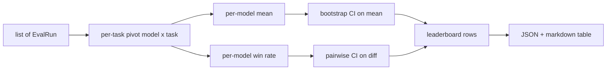
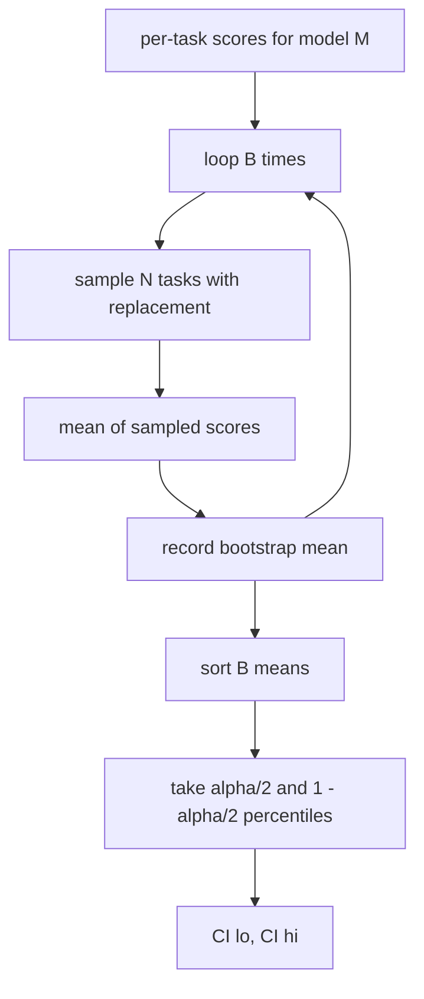

# 排行榜聚合

> 计算单项任务得分很容易，跨异构任务比较多个模型却难得多。至于包含一千条预测的排行榜是否具有统计显著性，几乎人人都会跳过这一步。本课不会。

**Type:** 构建
**Languages:** Python
**Prerequisites:** 第 19 阶段 Track B 基础课、第 70、71、73 课
**Time:** 约 90 分钟

## 学习目标

- 聚合多个模型在多项任务上的逐任务得分，为每个模型生成一条结构规整的记录。
- 归一化异构分数，避免通过率或 BLEU 数值对聚合结果产生过大影响。
- 分别按平均分与胜率排列模型，并解释每种汇总方式何时适用。
- 计算各模型平均分以及两两差值的 Bootstrap 置信区间。
- 将排行榜输出为 JSON 报告和 Markdown 表格，让第 75 课的运行器可以直接把结果粘贴到 CI 评论中。

```figure
ci-leaderboard-ci
```

## 输入结构

聚合器接收一个 `EvalRun` 记录列表：

```python
@dataclass
class EvalRun:
    model_id: str
    task_id: str
    metric_name: str
    score: float          # in [0, 1]
    category: str
```

第 75 课的运行器会为每个 `(model, task)` 组合发出一条记录。聚合器不关心得分如何产生，但要求上游已经完成归一化：每个得分都位于 `[0, 1]`。

## 输出

系统会产出三张表：



排行榜的每行数据包含：`model_id`、`mean_score`、`mean_ci_lo`、`mean_ci_hi`、`win_rate`、`tasks_completed`，以及可选的逐类别均值 `categories` 映射。

## 归一化

如果一项任务的得分范围为 `[0, 1]`，另一项却为 `[0, 100]`，后者会在不易察觉的情况下主导平均值。聚合器会验证每个输入得分都处于 `[0, 1]`，否则拒绝本次运行。这个问题应在上游修复：指标本身就应该返回比例。第 71–73 课会强制执行这项约定。

## 平均分与胜率

两种排名方式服务于不同目标。

平均分是某模型各项任务得分的平均值，也是排行榜通常报告的核心数字。它对离群值和任务不均衡较为敏感。

胜率统计一个模型在多少项共同任务上击败了所有其他模型。每项任务中得分最高的模型获胜，并列时平分胜场。胜率等于胜场数除以该模型有成绩的任务数。它较少受离群值和量纲差异影响，但会丢失得分幅度信息。

```python
def win_rate(model_id, runs_by_task, all_models):
    wins, total = 0, 0
    for task_id, runs in runs_by_task.items():
        scores = {r.model_id: r.score for r in runs if r.model_id in all_models}
        if model_id not in scores:
            continue
        total += 1
        best = max(scores.values())
        if scores[model_id] >= best:
            wins += 1
    return wins / total if total else 0.0
```

评估框架会同时报告二者。第 75 课的运行器默认按平均分排名；如果用户更看重胜率，可以直接查看 Markdown 表格中的相应列。

## Bootstrap 置信区间

每个模型的平均分都附有通过 Bootstrap 任务重采样估计的置信区间。我们对任务 ID 进行有放回抽样，计算重采样集合的平均值，重复 `B` 次，再取置信水平 `alpha` 对应的百分位区间。



对于两两比较，我们对逐任务差值 `score_A - score_B` 进行 Bootstrap，再报告其百分位区间。用户可以检查区间是否排除零：若排除，差异在 alpha 水平上显著；若未排除，排行榜会把两个模型视为并列。

底层辅助函数（`bootstrap_mean_ci`、`bootstrap_pairwise_diff`）默认使用 `B=1000`；对外提供的聚合函数（`aggregate`、`pairwise_diffs`）默认使用 `b=500`，让演示和测试保持快速。默认 alpha 为 0.05。本课只用 NumPy 实现 Bootstrap，不依赖 SciPy。

## 类别

如果设置了 `EvalRun.category`，聚合器还会报告逐类别均值，也就是排行榜中的 `math`、`reasoning`、`code`、`safety` 列。运行器据此可以发现某个模型是否总体表现优秀、却不擅长代码；总平均分会掩盖这种差异。

## Markdown 渲染

排行榜会渲染成 Markdown 表格：

```text
| Rank | Model | Mean | 95% CI | Win rate | Tasks |
|------|-------|------|--------|----------|-------|
| 1    | gpt   | 0.78 | 0.74-0.82 | 0.62 | 50 |
| 2    | claude| 0.75 | 0.71-0.79 | 0.34 | 50 |
| 3    | random| 0.10 | 0.07-0.13 | 0.04 | 50 |
```

表格按平均分排序。CI 渲染为两位小数。过长的模型 ID 会截断为二十个字符。

## 本课不做什么

本课不运行模型，不调用指标层，也不实现 Adaptive ECE 等其他校准变体；这些属于第 73 课。本课也不实现任务加权，每项任务的权重都相同。生产排行榜会为任务设置权重；我们通过 `weight` 字段保留扩展点，但聚合器暂不使用它。需要时可在后续课程中增加加权。

## 如何阅读代码

`main.py` 定义 `EvalRun`、`LeaderboardRow`、`aggregate`、`bootstrap_mean_ci`、`bootstrap_pairwise_diff` 与 `render_markdown`。演示构建一个包含三个模型和十二项任务的合成测试集，执行聚合，再打印排行榜与两两差值表。`code/tests/test_leaderboard.py` 中的测试固定 Bootstrap、Markdown 渲染、胜率边界情况与空输入行为。

从头到尾阅读 `main.py`。首先是数据结构（EvalRun、LeaderboardRow），随后依次是聚合、Bootstrap 和渲染逻辑。每个函数的职责边界都很清楚。

## 进一步探索

下一步应采用配对任务显著性，而不是非配对 Bootstrap。如果模型 A 与 B 都运行了相同的一百项任务，合适的检验是对逐任务差值执行配对 Bootstrap，本课已经实现。再进一步，则需要使用尊重任务家族结构的分层 Bootstrap，因为数学题之间并不独立，一种算术错误模式可能同时影响十道题。这属于后续内容；本课先确保评估报告中的数字经得起质疑。
