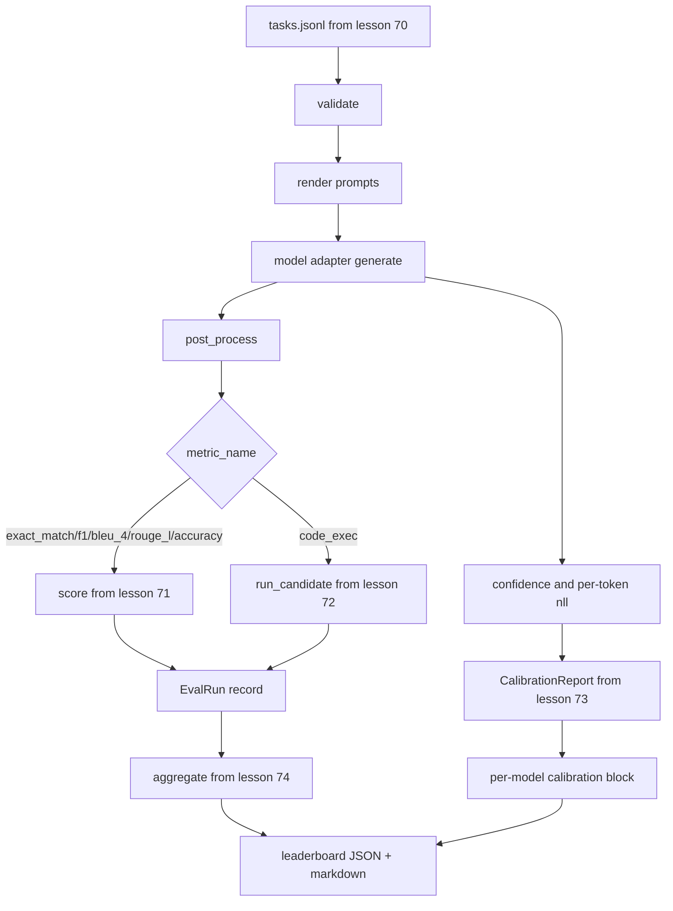

# 端到端评估运行器

> 前五课分别构建了所需组件，本课负责把它们连接起来。运行器读取第 70 课的任务规范，通过适配器调用模型，使用第 71 和 72 课的方法评分，附加第 73 课的校准报告，再输出第 74 课的排行榜。演示能够自行终止。

**Type:** 构建
**Languages:** Python
**Prerequisites:** 第 19 阶段 Track B 基础课、第 70 至 74 课
**Time:** 约 90 分钟

## 学习目标

- 定义一个 `ModelAdapter` 接口，让任意模型（模拟模型、本地模型、API）都能通过少量方法接入。
- 使用工作线程池并行执行任务，对固定的 JSONL 测试文件运行评估。
- 在单次流程中组合指标层（exact_match、F1、BLEU-4、ROUGE-L、code_exec）与校准层。
- 生成逐模型 `EvalRun` 记录，并将其直接传给排行榜聚合器。
- 同时输出 JSON 报告与 Markdown 表格；运行正常时自行以状态码 0 结束，验证或运行时失败则以非零状态码结束。

```figure
eval-grid
```

## 流水线



运行器是集成点。第 70–74 课各自负责一个由运行器组合的模块。运行器不会重复这些模块中的逻辑，而是直接导入它们。

## 适配器接口

适配器是运行器与任意模型之间的接缝。这个接口有意保持精简。

```python
class ModelAdapter:
    model_id: str

    def generate(self, prompt: str, task: TaskSpec) -> Generation: ...
```

`Generation` 是一个 dataclass，包含：

- `text`：模型的自由格式输出
- `confidence`：`[0, 1]` 范围内的浮点数，表示模型自行报告的答案概率
- `token_nll`：可选值，生成 token 的负对数似然之和
- `token_count`：可选值，生成的 token 数

运行器中的模拟适配器分为三类：`RuleBasedAdapter`（确定性、接近完美）、`NoisyAdapter`（过度自信、经常出错）和 `BiasedAdapter`（擅长一个类别，却极不擅长另一个类别）。演示会让三者都运行第 70 课的测试数据。

## 并行执行

运行器使用 `concurrent.futures.ThreadPoolExecutor`，为每个模型并行执行任务。工作线程数默认为 8 与任务数二者中的较小值。线程已经足够，因为真实模型调用的瓶颈是网络 I/O。代码执行路径会在任务内部启动自己的子进程，线程池只负责调度等待过程。

为了实现确定性测试，运行器公开 `run_eval(adapters, tasks, parallel=False)`，让测试可以固定执行顺序。

## 单遍评分循环

对每项任务执行：

1. 渲染提示（Few-shot 前缀加提示正文）。
2. 调用适配器并记录耗时。
3. 按任务规则后处理生成结果。
4. 分派给指标层。
5. 构建包含得分与指标元数据的 `EvalRun` 记录。
6. 将 `(confidence, correct)` 对追加到校准缓冲区。

`correct` 信号定义如下：对于分数必须完全命中的指标，采用 `score >= 1.0`，这类指标包括 `exact_match`、`accuracy` 和 `code_exec`；对于分级指标，则采用 `score >= 0.5`。阈值位于 `_correct_from_score` 中，运行器不提供公开的覆盖选项。

## 聚合

所有任务都产出结果后，运行器会调用第 74 课的 `aggregate` 与 `pairwise_diffs`，以及第 73 课的 `CalibrationReport.from_predictions`。输出是单个 JSON 信封：

```json
{
  "leaderboard": [...],
  "pairwise": [...],
  "calibration": {
    "model_id_a": {"ece": 0.04, "brier": 0.10, "populated_bins": 8, ...},
    ...
  },
  "summary": {
    "tasks": 10,
    "models": 3,
    "wall_seconds": 1.2
  }
}
```

运行器还会把 Markdown 表格写入 stdout，方便用户将结果直接粘贴到 PR 审查中。

## 可自行终止的演示

演示会使用三个模拟适配器，在第 70 课的十个固定测试任务上运行。挂钟时间应少于十秒；正常运行时退出码为零。

正常运行的标准如下：

- 每项任务都按照第 70 课完成验证。
- 每项任务都按照第 71 和 72 课完成评分。
- 校准报告按照第 73 课成功聚合，没有错误。
- 排行榜将基于规则的适配器严格排在随机适配器之前。

其中任何一项失败，运行器都会以非零状态码退出，并在 JSON 信封中返回结构化错误。

## 本课不做什么

本课不调用真实模型，不实现 API Key 流程或速率限制处理，也不实现流式或部分生成；适配器每次调用返回一个完整结果。本课还不处理重试或缓存。这些职责位于适配器层；运行器不依赖具体指标或模型提供商。

## 如何阅读代码

`main.py` 是集成入口。它通过一个小型 `_load_sibling` 辅助函数，以相对路径导入另外五节课程的模块。`Generation`、`EvalReport` 与 `ModelAdapter` dataclass 在本地定义，模拟适配器位于文件底部。

从头到尾阅读 `main.py`。先浏览导入项，然后看 `run_eval`，再看 `_score_one`，最后查看适配器。末尾的演示是入口点。

`code/tests/test_runner.py` 中的测试固定了适配器接口、单遍循环、并行与顺序执行的等价性、校准缓冲区以及 JSON 信封结构。

## 进一步探索

这个运行器只是最低基线。生产评估系统还会增加：以 `(task_id, model_id, model_version)` 为键的结果缓存、追踪每次运行美元与 token 成本的成本台账、遇到速率限制时执行退避的重试层、面向 pass-at-k 任务的采样策略，以及适用于大型测试套件的流式输出格式。这些都是包装运行器的独立关注点，无须改变指标层或聚合层；这种分离正是该接口约定的重点。

模拟适配器能够工作后，再为真实模型提供商添加适配器。选择一家提供免费额度的服务商，编写约三十行适配代码，排行榜就会显示真实结果。随后添加第二家服务商，其余比较工作交给评估框架完成。
