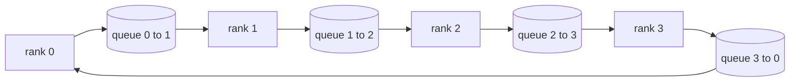

# 从零实现集合通信原语

> 支撑分布式训练的四个集合通信操作是 allreduce、broadcast、allgather 和 reduce_scatter。训练框架提供的其他高层原语，本质上都是对它们的封装。只要先在 `multiprocessing.Queue` 网格上把这四个操作实现一遍，再拿参考实现做校验，这条路线后面的内容就都只是管线拼装。

**Type:** 构建
**Languages:** Python
**Prerequisites:** 第 19 阶段 Track C 第 42–49 课
**Time:** 约 90 分钟

## 学习目标

- 用两趟算法实现 ring allreduce，也就是先 reduce-scatter 再 allgather，并证明每个 rank 的通信量为每元素 2(N-1)/N 字节。
- 在 `multiprocessing.Queue` 点对点发送的基础上实现 broadcast、allgather 和 reduce_scatter。
- 把每个原语的输出与同样输入下的 `torch.distributed` gloo 参考结果进行逐一对比。
- 说明在不同集群形状、延迟下限和带宽上限下，为什么有时 ring 更优，有时 tree 更优。

## 问题

朴素的 allreduce 在 N 个 rank 上需要把张量发送 N 次到根节点，再广播 N 次回来。这样每个 rank 的带宽开销按 O(N) 增长，根节点成为瓶颈，整步耗时的下限变成最慢链路乘以 N。ring allreduce 把过程压平成 2(N-1) 个大小为 T/N 的块，因此每个 rank 的总字节数下降到 2T(N-1)/N，与集群规模无关。tree allreduce 则在小 N 或高延迟链路上更占优，因为它的深度是 log2(N) 跳，而不是 2(N-1)。如果拓扑选择不适合集群形态，最慢的 GPU 就会决定每一步的耗时。

这条路线里你会碰到的每个分布式训练框架，都建立在这四个原语之上。PyTorch DDP 用 allreduce 同步每个参数桶的梯度；ZeRO 通过 reduce_scatter 分片优化器状态，再用 allgather 取回完整参数；FSDP 让完整前向传播变成 allgather 加 reduce_scatter；流水线并行则需要在各阶段组之间广播激活值。如果你不能亲手实现这四个集合通信，就很难解释训练为什么停住、为什么梯度只在 rank 3 出现不匹配，或者为什么更换拓扑后 pipeline bubble 会翻倍。

## 概念



### 用两趟完成 ring allreduce

先把张量切成 N 个等大小的块，编号为 0..N-1。每个 rank 起初持有与自己 rank 同编号的块。第一趟 reduce-scatter 运行 N-1 步：在第 s 步中，rank r 把 (r - s) mod N 号块发送给 (r + 1) mod N，同时从 (r - 1) mod N 接收 (r - s - 1) mod N 号块，并把收到的块累加到本地副本里。经过 N-1 步后，rank r 拥有第 r 号块的完整求和结果。第二趟 allgather 再运行 N-1 步，把这些已经求和完成的块沿环继续旋转，直到每个 rank 都拿到全部块的完整和。

| 原语 | 每个 rank 的字节数 | 步数 | 适用场景 |
|-----------|---------------|-------|-------------|
| 环形 allreduce | 2T(N-1)/N | 2(N-1) | T 较大、链路带宽高的同构集群 |
| 树形 allreduce | T log2(N) | 2 log2(N) | T 较小或链路延迟较高 |
| 广播（broadcast） | T | log2(N) 层树 | 参数初始化、标量配置 |
| 全收集（allgather） | T(N-1)/N | N-1 | 分片前向传播、ZeRO 反分片 |
| 归约分散（reduce_scatter） | T(N-1)/N | N-1 | ZeRO 梯度分片 |

### 用队列网格代替 NCCL

NCCL 运行在 PCIe 和 NVLink 之上，并且可以借助硬件完成规约。CPU 环境里没有这层硬件支持。对环上的每条边放一个 `multiprocessing.Queue`，就能得到单生产者、单消费者、顺序一致的点对点传输。规约发生在用户态，因此你要承担 Python 的额外开销，但线上的通信模式与 NCCL 的 ring allreduce 是同构的。只要在队列版本上把正确性想清楚，集群版本的行为也就能解释通。

### 用 gloo 做参考校验

每个原语都配有一个单元测试，把它的输出与在同样张量、同样 world size 下初始化 `torch.distributed` gloo backend 的参考实现进行比较。如果你的 ring allreduce 与 gloo 的差异超过 float32 epsilon，测试就会失败。拿参考实现校验不是可选项；否则它在前几步看起来可能“没问题”，但一到真实训练的第 10000 步就会暴露错误。

```figure
ci-ring-allreduce
```

## 动手构建

`code/main.py` 实现了：

- `Mesh` 类：把 N 个 `multiprocessing.Queue` 实例连成一个环，并为每个 rank 暴露 `send(dst, tensor)` 与 `recv(src)`。
- `ring_allreduce(mesh, rank, world_size, tensor)`：实现两趟 ring 算法。
- `broadcast(mesh, rank, world_size, tensor, src)`：沿对数深度的树执行广播。
- `allgather(mesh, rank, world_size, tensor)`：通过 N-1 次旋转完成聚集。
- `reduce_scatter(mesh, rank, world_size, tensor)`：也就是 allreduce 的前半段。
- `_gloo_reference(op, world_size, tensor)`：把同样输入送入 `torch.distributed` 的 gloo 实现，做逐字节级对比。

运行它：

```bash
python3 code/main.py
```

输出会先给出一张逐原语的验证表，对比 queue mesh 与 gloo 的结果；随后打印逐 rank 的字节计数，证明 2T(N-1)/N 的通信量缩放关系。

## 生产环境中的常见模式

有三种模式会把这些原语从“能跑”提升到“可交付”。

**在 allreduce 之前先做梯度分桶。** 一个 10 亿参数模型会产生数万个梯度张量。每个张量各发起一次 allreduce，就要数万次支付网络延迟下限。DDP 会把梯度合并为大约 25 MB 的桶，然后每个桶只做一次 allreduce；小张量跟着大桶一起过线。没有分桶时，延迟开销会主导整步耗时。

**让通信与计算重叠。** 反向传播按层逆序产生梯度。最后一层梯度一准备好，就立即启动它的 allreduce，同时下一层继续计算。PyTorch DDP 通过 bucket-ready hook 完成这件事。当网络还有余量时，重叠可以把可见通信时间砍掉一半。

**根据消息大小选 ring 或 tree，而不是凭信仰。** NCCL 自带拓扑探测器：消息大于约 1 MB 时倾向选 ring，低于这个阈值时更偏向 tree。分界点本质上是带宽与延迟的权衡：在 1 MB 以上，2T(N-1)/N 的带宽项占主导，ring 胜出；在 1 MB 以下，log2(N) 的跳数更关键，tree 胜出。把某一种拓扑写死，会在不合适的消息规模上损失吞吐。

## 实际应用

生产模式：

- **PyTorch DDP。** 在 backward 之后对梯度桶调用 `dist.all_reduce`。桶大小可调；对 100Gbit 以太网而言，默认 25 MB 通常是合理起点。
- **DeepSpeed ZeRO。** 用 reduce_scatter 对梯度分片，用 allgather 在 forward 前还原完整参数。本课实现的原语，就是 ZeRO 实际发出的那些通信调用。
- **FSDP。** 前向传播先通过 allgather 反分片当前层，计算完成后再用 reduce_scatter 归并并丢弃未持有的部分。原语相同，只是调度顺序不同。

## 交付成果

第 77 至 81 课会直接复用这里的 queue mesh 原语。第 77 课把 allreduce 接进 DDP；第 78 课把 reduce_scatter 接进 ZeRO；第 79 课把 broadcast 接进流水线激活传递；第 81 课则把四种原语全部组合进端到端演示。

## 练习

1. 添加 tree allreduce 变体，并根据消息大小在 ring 与 tree 之间切换。测量分界点。
2. 添加一个 `recv_timeout_ms`，让卡住的 rank 报出超时错误，而不是永远挂起。
3. 用 TCP socket 替换 `multiprocessing.Queue` 来实现这四个原语。测试不变，但换成真实链路。
4. 添加带宽打点钩子，让逐 rank 字节计数记录到 JSONL。
5. 在 4 个 rank 上比较 ring 与 tree 处理 1KB、1MB、16MB 张量时的墙钟时间，并用实测结果说明分界点。

## 关键术语

| 术语 | 人们常说 | 实际含义 |
|------|----------------|------------------------|
| Allreduce | “跨 rank 求和” | 调用结束后，每个 rank 都持有相同的规约后张量 |
| Ring | “最快的拓扑” | 大小为 T/N 的 N-1 个块沿环路传两圈 |
| Tree | “对数拓扑” | 规约沿二叉树进行，深度是 log2(N) 跳 |
| Allgather | “拼回所有分片” | 每个 rank 最终都拿到其他所有 rank 的分片 |
| Reduce_scatter | “边求和边切分” | 每个 rank 最终只保留一个块的求和结果 |
| Bucket | “融合小张量” | 把 N 次小 allreduce 合并为一次大的 allreduce |

## 延伸阅读

- [PyTorch Distributed: NCCL collectives](https://pytorch.org/docs/stable/distributed.html#collective-functions)
- [Horovod ring allreduce paper](https://arxiv.org/abs/1802.05799)
- [NCCL topology and algorithm selection](https://docs.nvidia.com/deeplearning/nccl/user-guide/docs/index.html)
- [Patarasuk and Yuan, Bandwidth optimal allreduce algorithms](https://www.cs.fsu.edu/~xyuan/paper/09jpdc.pdf)
- 第 10 阶段第 05 课：分布式训练概览
- 第 19 阶段第 77 课：在这些原语之上接线 DDP
