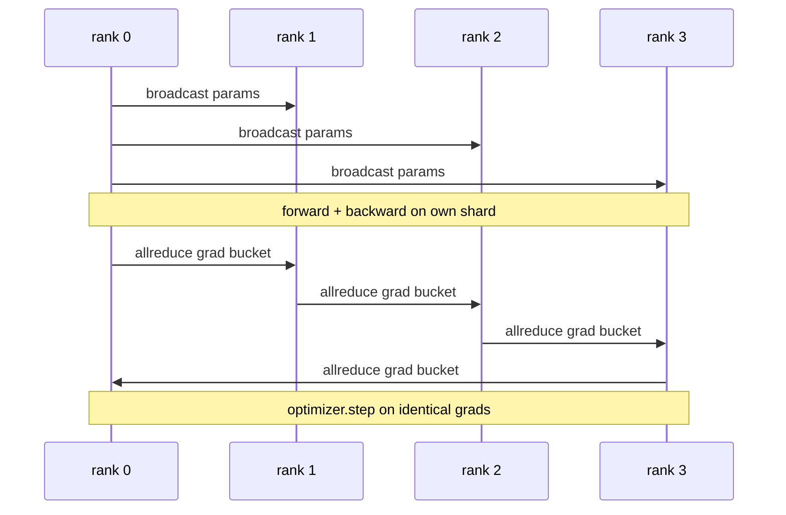

# 从零实现数据并行 DDP

> DistributedDataParallel 本质上是叠在 allreduce 之上的一层 hook。把模型包起来，从 rank 0 广播初始参数，让所有 rank 从同一组权重开始；再给每个参数挂上 backward hook，在反向传播后对梯度执行 allreduce；剩下的部分就只是普通的梯度下降。整个模式大约 200 行代码就能写清楚。

**Type:** 构建
**Languages:** Python
**Prerequisites:** 第 19 阶段 Track C 第 42–49 课
**Time:** 约 90 分钟

## 学习目标

- 接好一个 `DistributedDataParallel` 形状的包装器，在初始化时广播参数，并在 backward 之后对梯度做 allreduce。
- 使用 `torch.multiprocessing.spawn` 在 gloo backend 上拉起 N 个 CPU rank，并通过基于文件的 rendezvous 完成初始化。
- 通过在同样数据上训练同一个模型的串行版本，并比较每一步的参数是否一致，证明梯度同步是正确的。
- 说明为什么“分桶”和“通信与 backward 重叠”这两项改动，能把一个能运行的 DDP 变成一个可用于生产的 DDP。

## 问题

一个拥有 10 亿参数、12 GB 激活值的模型，单张消费级 GPU 根本放不下。即便放得下，训练也可能需要数周。数据并行的做法是把 batch 切到 N 个 rank 上，每个 rank 在自己的分片上完成 forward 与 backward；随后在每一步把所有 rank 的梯度相加，让这 N 份模型副本始终保持一致。优化器实际更新的，就是这个汇总后的梯度。

如果没有梯度同步，这 N 个副本到第 2 步就会开始分叉。模型不再是“一个模型在更多数据上训练”，而是 N 个恰好共享初始权重的独立模型。如果梯度同步做得很糟，比如每个参数都单独 allreduce、没有与计算重叠、没有梯度分桶，那么网络就会成为瓶颈，GPU 只能空等链路。DDP 的真正工艺，就是让梯度同步相对计算而言几乎“免费”。PyTorch 标准 DDP 之所以高效，靠的是梯度分桶、把 allreduce 与下一层 backward 重叠，以及在 NVLink 上使用 NCCL。我们也可以在 CPU + gloo 上把这三件事都做出来，并学到同样的规律。

## 概念



### DDP 需要的三个操作

| 阶段 | 集合通信 | 原因 |
|-------|-----------|-----|
| 初始化 | 从 rank 0 广播 | 每个 rank 都从相同参数开始 |
| 反向传播（backward）之后 | 对每个梯度执行 allreduce | 优化器使用平均梯度执行更新 |
| 特定场景 | 广播缓冲区（buffer） | 保持 BatchNorm 的运行统计量同步 |

### 为什么取平均而不是直接求和

Allreduce-SUM 再除以 world_size，得到的是平均梯度。平均梯度对 world_size 不敏感：在单 rank 上调好的学习率，放到 4 个 rank 上依然成立，因为每一步梯度的量级没有变化。若只做 Allreduce-SUM 而不除以 world_size，每次改变集群规模都要重新调学习率。PyTorch DDP 会替你完成这一步；本课也要照样实现。

### 为什么要做梯度分桶

一个 Transformer 通常有数千个参数张量。若每个张量都单独 allreduce，就要数千次支付 gloo 的延迟下限。DDP 会把梯度合并成大约 25 MB 的桶，然后每个桶只发起一次 allreduce。总传输字节数并没有变少，但延迟被摊薄了。对于本课这个很小的模型，我们把所有梯度都放进一个桶里；要学的是结构，而不是规模。

### 为什么要钉住随机种子

每个 rank 在打乱数据时都应调用 `torch.manual_seed(seed + rank)`，而在初始化参数时应调用 `torch.manual_seed(seed)`。如果所有 rank 共用同一个打乱种子，它们就会看到完全相同的 batch 顺序，数据并行失去意义；如果参数初始化使用按 rank 变化的种子，那么一开始各 rank 的参数就会产生 float epsilon 级别的不一致，梯度同步也无法再让各副本保持完全相同。种子策略一旦写错，参数一致性测试会在第 1 步就失败。

```figure
ci-ddp-grad-sync
```

## 动手构建

`code/main.py` 实现了：

- `MiniMLP`：一个三层 MLP，小到几秒内就能收敛，大到足以暴露接线细节。
- `DistributedDataParallel(model, world_size)`：在构造时广播参数，并返回一个包装器；它的 `sync_grads` 会把 allreduce 累加后的梯度再除以 world_size。
- `worker(rank, world_size, ...)`：完整训练循环，负责初始化 `torch.distributed` 的 gloo backend，执行 forward、backward、sync 与 step。
- `_reference_single_process_loop(...)`：在单进程上用同样数据训练同一个模型，供测试在每一步比较参数是否逐字节一致。

运行它：

```bash
python3 code/main.py
```

输出会是一张逐步训练表，对比单进程路径与 4 个 rank 的 DDP 路径的损失和参数校验值。两条路径会得到仅差 float epsilon 的同一条损失曲线，这证明梯度同步是正确的。

## 生产环境中的常见模式

有三种模式会把 DDP 从“能用”提升到“可交付”。

**Find unused parameters。** 某些前向路径会按条件跳过部分参数，比如早退出路径或 mixture-of-experts 路由器。被跳过的参数没有梯度，但 DDP 的 bucket-ready hook 仍会等待它们，最终导致 allreduce 死锁。`find_unused_parameters=True` 会在规约前先检查哪些参数真的产生了梯度。代价是每一步都要额外遍历计算图，因此只有当前向确实会分支时才值得打开。

**Static graph optimisation。** 当前向结构在各步之间保持不变时，`static_graph=True` 可以让 DDP 预先计算桶调度。这个优化在大规模训练上很有意义：每步节省的几毫秒，乘上一万步就是实打实的成本。

**Gradient accumulation needs care。** 如果你要在 K 个微批次上累计梯度，而不是每个微批次都同步一次，那么吞吐量可能直接提升 10 倍。DDP 提供 `no_sync()` 作为上下文管理器，用来跳过 post-backward allreduce。要是忘了用这个管理器，就会白白执行 K 次 allreduce，吞吐会直接掉到底。

## 实际应用

生产模式：

- **PyTorch DDP。** 标准实现，`torch.nn.parallel.DistributedDataParallel(model)` 会自动接好分桶、重叠以及 no_sync 上下文。
- **HuggingFace Accelerate。** 在外层加了一个 launcher，帮你处理 `torchrun` 环境变量和模型包装；底层仍然是 DDP。
- **Megatron-LM data parallel。** 在超大模型上把 DDP 与 tensor parallel 组合使用；其中数据并行部分仍然是相同的 backward 后 allreduce 模式。

## 交付成果

第 78 课会用 reduce_scatter 取代逐参数 allreduce，这样每个 rank 只保存优化器状态的分片。第 81 课则把 DDP 与 ZeRO 组合起来，做成端到端演示。

## 练习

1. 添加可配置大小的梯度桶，并在更深的模型上比较它与“每个参数一次 allreduce”的速度差异。
2. 把 `no_sync()` 实现为上下文管理器，并验证在 K 个微批次上的梯度累计结果与单进程基线一致。
3. 添加一个 `find_unused_parameters` 模式，让前向传播有时跳过某一层 MLP；不打开这个标志时，运行应当死锁。
4. 用只做 `torch.distributed.barrier()` 的同步方式替代 gloo allreduce，体会基于 allreduce 的同步与纯 barrier 同步的差别。
5. 测量 batch size 为 1、16、256 时，梯度同步开销占总 step time 的比例，并解释其缩放规律。

## 关键术语

| 术语 | 人们常说 | 实际含义 |
|------|----------------|------------------------|
| DDP | “数据并行” | 一个每步都会广播参数并 allreduce 梯度的包装器 |
| Bucket | “融合梯度” | 把 N 次小 allreduce 合并成一次大 allreduce |
| Overlap | “隐藏通信” | 后面层还在 backward 时，就提前发起 allreduce |
| no_sync | “累积梯度” | 为了梯度累计，跳过 post-backward allreduce |
| find_unused | “分支前向” | 在规约前检测哪些参数没有梯度 |

## 延伸阅读

- [PyTorch DistributedDataParallel docs](https://pytorch.org/docs/stable/generated/torch.nn.parallel.DistributedDataParallel.html)
- [PyTorch DDP internals tutorial](https://pytorch.org/tutorials/intermediate/ddp_tutorial.html)
- [Li 等，《PyTorch Distributed: Experiences on Accelerating Data Parallel Training》](https://arxiv.org/abs/2006.15704)
- 第 19 阶段第 76 课：DDP 建立在这些集合通信之上
- 第 19 阶段第 78 课：ZeRO 用 reduce_scatter 取代逐参数 allreduce
