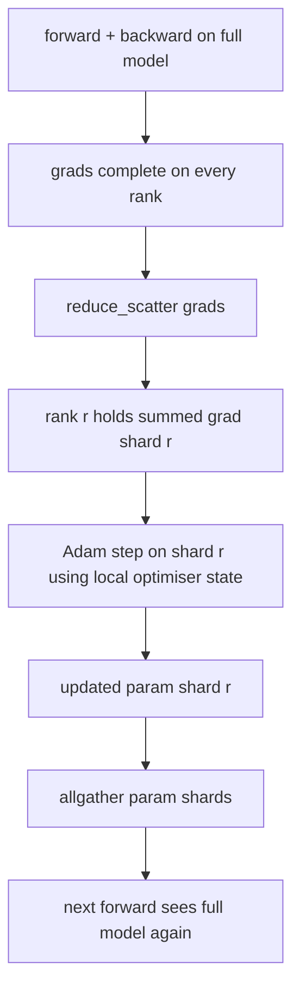

# ZeRO 优化器状态分片

> Adam 会为每个参数保存两个 float32 的动量估计。一个 7B 参数模型，仅优化器状态就要占 56 GB。ZeRO stage 1 会把这些状态分到 N 个 rank 上，每个 rank 只持有优化器的 1/N。每个本地 step 结束后，更新后的参数分片会再广播回来，让所有 rank 重新拼出完整模型，然后开始下一步。它带来的收益，是把训练栈中最大那一块单项内存开销线性压低。

**Type:** 构建
**Languages:** Python
**Prerequisites:** 第 19 阶段 Track C 第 42–49 课
**Time:** 约 90 分钟

## 学习目标

- 把优化器状态，也就是一阶动量、二阶动量以及 fp32 主副本，分片到 N 个 rank 上，让每个 rank 只持有 1/N。
- 使用 reduce_scatter 只把每个 rank 自己那一片梯度和发送给它，再用 allgather 把更新后的参数分片广播回去。
- 计算 stage 1、stage 2、stage 3 相对 vanilla DDP 的内存节省表。
- 根据模型规模和带宽预算，说明为什么有时该用 stage 1，有时该升到 stage 2 或 stage 3。

## 问题

vanilla DDP 会复制一切：参数、梯度和优化器状态都在每个 rank 上完整存在。对于一个 fp16 的 7B 参数模型，这意味着每个 rank 都要持有 14 GB 参数、14 GB 梯度和 28 GB 优化器状态。这里面，优化器状态是最大项，也是最容易先做分片的项，因为它只在 optimizer step 时被访问，而不会出现在 forward 或 backward 的主路径里。

ZeRO stage 1 正是对优化器状态做分片。每个 rank 只保留 Adam 动量的 1/N。backward 结束后，ZeRO 不再把完整梯度 allreduce 给每个 rank，而是先 reduce_scatter，使每个 rank 只收到属于自己那片参数的梯度和。该 rank 随后只对自己持有的主参数分片执行优化器更新。更新后的参数分片再通过 allgather 发回，让所有 rank 在下一次 forward 开始前重新拥有完整模型。优化器内存因此按 N 倍下降，而每步在线路上的总通信量与 DDP 按带宽计其实相同：一次 reduce_scatter 加一次 allgather，等价于一次 allreduce。换句话说，内存赢了，吞吐基本不变。

## 概念



### ZeRO 的各个阶段

| 阶段 | 分片对象 | 每个 rank 的内存 | 每步通信 |
|-------|----------------|------------------|---------------|
| DDP | 不分片 | params + grads + optim | 1 次 allreduce |
| ZeRO-1 | 优化器状态 | params + grads + optim/N | 1 次 reduce_scatter + 1 次 allgather |
| ZeRO-2 | 优化器状态 + 梯度 | params + grads/N + optim/N | 1 次 reduce_scatter + 1 次 allgather |
| ZeRO-3 | 优化器状态 + 梯度 + 参数 | params/N + grads/N + optim/N | 每层 1 次 allgather + 1 次 reduce_scatter |

阶段 1 是成本最低、最容易获得的收益，因为优化器状态通常占据最大的内存开销。阶段 2 需要额外的梯度分片累积逻辑，但带宽并没有本质变化。阶段 3，也就是 FSDP 形态，会在每层前向/反向传播时增加通信开销，以换取参数分片带来的内存下降。本课完整实现阶段 1。

### 真实数字下的内存数学

对于一个参数量为 P、用 Adam 做混合精度训练的模型：

| 项目 | 常规方案（Vanilla） | ZeRO-1 | 原因 |
|------|---------|--------|-----|
| fp16 参数 | 2P 字节 | 2P 字节 | 前向传播（forward）所需 |
| fp16 梯度 | 2P 字节 | 2P 字节 | 反向传播（backward）所需 |
| fp32 主副本 | 4P 字节 | 4P/N 字节 | 仅优化器使用 |
| fp32 一阶动量 | 4P 字节 | 4P/N 字节 | 仅优化器使用 |
| fp32 二阶动量 | 4P 字节 | 4P/N 字节 | 仅优化器使用 |
| 合计 | 16P 字节 | 4P + 12P/N 字节 |   |

当 N=8 时，vanilla 是 16P，ZeRO-1 是 5.5P，下降约 65%。当 N=64 时，vanilla 是 16P，ZeRO-1 是 4.19P，下降约 74%。

### 为什么 reduce_scatter 优于 allreduce 再切片

allreduce 会把完整求和后的梯度交给每个 rank。如果某个 rank 只需要自己的那一片，那么其中 (N-1)/N 的梯度对它来说都是白算白传的。reduce_scatter 正好只把每个 rank 该拿的那一片送过去。按每 rank 字节数计算，它与 allreduce 相同，因为 allreduce 本质上就是 reduce_scatter 加 allgather；但这里第二段 allgather 被挪到了“参数分片更新后再广播”这一阶段。因此总线流量与 DDP 相同，内存却被真正分开了。

```figure
cd-zero-shard
```

## 动手构建

`code/main.py` 实现了：

- `flatten_params(module)` 和 `unflatten_into(module, flat)`：把模型参数压平到一个连续张量中，再按原布局写回。正因为是扁平布局，按 rank 分片才只需要简单切片。
- `ZeroOptimizer(model, world_size, rank, lr)`：持有该 rank 自己那一片 master copy 和 Adam 动量状态。
- `step()`：先对扁平梯度执行 reduce_scatter，再只对本 rank 的参数分片执行 Adam 更新，最后把更新后的参数通过 allgather 拼回完整模型。
- 一个演示：训练一个三层 MLP 共 20 步，并把每步的内存预算打印出来，与 vanilla DDP 做对照。

运行它：

```bash
python3 code/main.py
```

输出会展示逐步损失，以及一张内存表，说明 ZeRO-1 在每个 rank 上只保留了 1/N 的优化器状态，而 DDP 仍然保留完整副本。

## 生产环境中的常见模式

有三种模式会把 ZeRO 从“概念成立”推进到“工程可用”。

**分片检查点不可或缺。** ZeRO-1 的优化器状态已经切到各个 rank 上，因此检查点必须记住“哪个 rank 拥有哪一片”。第 80 课构建的正是这种分片检查点 manifest，它能在相同 world size 上恢复 ZeRO 运行。没有它，保存下来的状态在重启时几乎无法正确读回。

**混合精度才是重点。** ZeRO 本质上是一种混合精度训练技术；真正被切分的是 fp32 master copy。如果不开混合精度就启用 ZeRO，就要承担 fp32 主副本的内存税，却拿不到 fp16 forward 带来的收益。生产训练几乎总是把 ZeRO 与 autocast 或 bf16 权重一起使用。

**Stage 1 是近乎免费的胜利。** 就带宽而言，它与 DDP 相同；就内存而言，它的收益按 N 线性增长。额外成本主要是优化器分片的账本管理。因此生产系统通常默认从 stage 1 开始；只有当参数本身的内存也成为问题时，才继续升到 stage 2 或 stage 3，用更多通信换更多内存。

## 实际应用

生产模式：

- **DeepSpeed ZeRO。** 参考实现。`deepspeed_config.json` 里可以选择 stage 1、2、3 以及分区大小。
- **PyTorch FSDP。** PyTorch 原生的等价方案。`ShardingStrategy.SHARD_GRAD_OP` 对应 ZeRO-2，`FULL_SHARD` 对应 ZeRO-3。
- **HuggingFace Accelerate。** 在统一配置层上同时封装 DeepSpeed 与 FSDP。

## 交付成果

第 79 课的 pipeline parallel 是另一条正交的分片轴：它不是在同一模型上切优化器状态，而是把层切到不同 rank 上。第 81 课则把 DDP 与 ZeRO 组合进端到端演示中。

## 练习

1. 扩展到 ZeRO-2，把梯度也做分片：每个 rank 只保存自己的梯度分片，做法是在 backward 后把非本分片部分清零。
2. 添加一个内存 profiler，在 rank 0 打印真实的 fp32 字节占用，并与公式预测做比较。
3. 测量 vanilla DDP 与 ZeRO-1 的每步墙钟时间，并拆成 forward、backward、comm 三段。
4. 在 ZeRO-1 下实现梯度裁剪：L2 norm 必须通过对各个分片的局部范数平方做 allreduce 得到。
5. 用 allreduce 而不是 reduce_scatter 实现一个“朴素 ZeRO”，测量线路时间差异，并用实测数字说明为什么要选择 reduce_scatter。

## 关键术语

| 术语 | 人们常说 | 实际含义 |
|------|----------------|------------------------|
| ZeRO-1 | “分片优化器” | 每个 rank 只持有 1/N 的 fp32 master copy 和 Adam 动量 |
| ZeRO-2 | “连梯度也分片” | 每个 rank 在 reduce_scatter 后也会丢弃非本分片梯度 |
| ZeRO-3 | “参数也分片” | 每个 rank 只保留 1/N 的 fp16 参数；forward 中按层 allgather |
| Master copy | “fp32 权重” | 优化器真正更新的那份高精度参数副本 |
| Reduce_scatter | “边求和边切分” | 每个 rank 只拿到属于自己那一片的梯度和 |

## 延伸阅读

- [Rajbhandari et al, ZeRO: Memory Optimizations Toward Training Trillion Parameter Models](https://arxiv.org/abs/1910.02054)
- [DeepSpeed ZeRO documentation](https://www.deepspeed.ai/tutorials/zero/)
- [PyTorch FSDP documentation](https://pytorch.org/docs/stable/fsdp.html)
- 第 19 阶段第 76 课：本课建立在那里的 reduce_scatter 和 allgather 之上
- 第 19 阶段第 80 课：ZeRO 状态必须配合分片检查点一起保存
