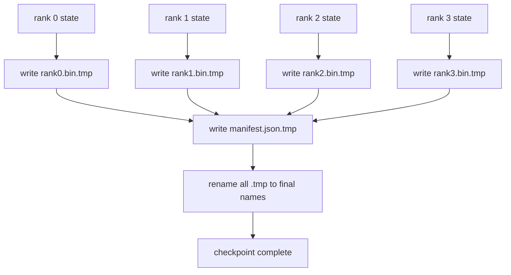

# 分片检查点与原子恢复

> 一个 70B 参数训练任务每隔几小时就可能被节点故障打断。检查点格式决定你损失的是 30 分钟，还是 30 小时。分片检查点会让每个 rank 并行写出自己的分片，并在 manifest 中记录所有权。恢复时，每个 rank 只从自己的文件加载自己的分片，在相同的 world size 上重建状态，优化器可以像什么都没发生过一样继续执行。原子写则保证一个写到一半的检查点不会污染下一次恢复。

**Type:** 构建
**Languages:** Python
**Prerequisites:** 第 19 阶段 Track C 第 42–49 课
**Time:** 约 90 分钟

## 学习目标

- 把多 rank 检查点保存为“每个 rank 一个分片文件”加上一份记录各分片归属的 manifest。
- 使用原子写模式，也就是先写临时路径再 rename，保证写到一半时崩溃也不会留下半成品检查点。
- 从 manifest 恢复，并验证 fp16 参数和 ZeRO 优化器状态在每个 rank 上都能逐字节一致。
- 说明 manifest schema 如何防御三种故障模式：world size 变化、分片数量不匹配，以及部分写入。

## 问题

传统检查点的做法是：把所有参数和优化器状态都 gather 到 rank 0，然后写成一个大文件。对于 70B 模型，这意味着要把 1.1 TB 状态全都压过一个 rank 的网络口。其他 rank 会因为等待 gather 而空闲，IO 带宽受限于最慢那条单链路，而不是集群总带宽。在真实集群里，这一步 gather 再写出的耗时，可能比之前整整一小时训练还长，于是一天内连一个完整检查点都很难稳定产出。

分片检查点正好把模式反过来：每个 rank 并行写出自己的那一片状态，manifest 记录哪个 rank 拥有哪个分片，因此恢复时也能把这些分片准确放回原来的位置。总写带宽随着集群规模提升。一个通过单 rank 需要 4 小时写完的 1 TB 检查点，通过 64 个 rank 并行写可能只需要 4 分钟。此外，manifest 还给了你一份恢复契约：world size 变化能被检测，部分写入能被检测，load 路径可以“响亮失败”，而不是悄悄加载陈旧或损坏数据。

## 概念



### Manifest 结构

```json
{
  "world_size": 4,
  "step": 1234,
  "wall_clock_seconds": 4521,
  "shards": [
    {"rank": 0, "path": "rank0.bin", "sha256": "...", "param_shard_offset": 0, "param_shard_numel": 65536},
    {"rank": 1, "path": "rank1.bin", "sha256": "...", "param_shard_offset": 65536, "param_shard_numel": 65536}
  ],
  "schema_version": 1
}
```

有三个字段是承重件。`world_size` 用来保证在不同 world size 上恢复时直接报错，而不是静默损坏；`sha256` 用来检测部分写入或文件损坏；`param_shard_offset` 与 `param_shard_numel` 则告诉加载器每个分片应当放回扁平参数张量的哪个位置。

### 原子写

标准模式是：先把每个分片写到 `<name>.tmp`，再把 manifest 写到 `manifest.json.tmp`，对每个文件执行 fsync，然后再 rename。POSIX 在同一文件系统内的 rename 是原子的：要么你看到的是旧文件，要么你看到的是完整的新文件。若在最后 rename 之前发生崩溃，活着的仍然是上一版检查点。没有原子写的话，就可能留下一个只有一半内容的分片文件，manifest 却已经指向了它，恢复时就会把优化器状态带着损坏继续加载进去。

### 结构必须防住的三种故障模式

| 故障 | 表现 | 防线 |
|---------|---------|---------|
| world size 变化 | 在 N=8 上加载来自 N=4 的 manifest | 在 manifest 中检查 world_size 不匹配并直接报错 |
| 分片数量不匹配 | 恢复时看到的 rank*.bin 文件少于 manifest 记录的 shards 数量 | 枚举所有分片并验证每一个都存在 |
| 部分写入 | 分片文件在 flush 过程中被截断 | 加载时执行 sha256 校验 |

每种防线都应该尽早拒绝坏恢复。另一种选择是“静默损坏”，而那类问题往往要等到 100 步之后 loss 变成 NaN 时才会显现。

### 为什么要每个 rank 一个文件，而不是一个大文件

在 POSIX 上使用 `O_APPEND` 对一个大文件并发写，理论上对字节追加是可行的；但现实里，每个分片对应的是 MB 级偏移区间，锁竞争会迅速变成瓶颈。每个 rank 各写各的文件，则完全没有写锁争用；若底层文件系统本身支持并行条带化，例如 Lustre 或 GPFS，这种布局还能天然受益。DeepSpeed、FSDP、NeMo 等生产系统都采用逐 rank 文件，原因就在这里。

```figure
ci-sharded-checkpoint
```

## 动手构建

`code/main.py` 实现了：

- `ShardManifest` 数据类，承载上述 schema，并提供 `to_json` 与 `from_json`。
- `save_sharded(state_dict_per_rank, dir, step)`：使用“先写临时文件再 rename”的原子模式，把每个 rank 的二进制状态写到自己的文件，再写出 manifest。
- `load_sharded(dir, expected_world_size)`：读取 manifest、校验每个分片的 sha256，并返回逐 rank 的状态字典。
- 一个 round-trip 测试：构造逐 rank 状态，保存，再加载，并断言结果逐字节相等。

运行它：

```bash
python3 code/main.py
```

输出会显示：4 个分片文件和 manifest 被写出，随后再被加载回来，并完成逐字节一致性验证。

## 生产环境中的常见模式

有三种模式会把检查点机制从“可用”推进到“可交付”。

**Async write。** 生产系统通常把检查点写入放到单独线程或进程中，让训练可以继续推进。真正的 barrier 出现在下一个检查点开始前：只有上一次写完，才允许开始下一次保存。DeepSpeed 的 `async_io` 做的就是这件事。本课刻意保持同步写入，让步骤更容易观察。

**先写本地快盘，再异步上传。** 先写到本地 NVMe，速度快；随后异步上传到 S3 或 GCS。两层存储模式让集群内恢复仍然保持高速，同时也把一份持久副本送到集群外做归档。manifest 记录本地路径；上传 manifest 则记录远端路径。

**Rotation 很重要。** 生产任务通常只保留最近 K 个检查点，一般是 3 到 5 个，并在写新检查点前先删除最旧的。如果没有 rotation，磁盘会在训练进行到一半时被写满，下一次保存直接失败。有了 rotation，新的保存会先释放预算，再写入新版本。

## 实际应用

生产模式：

- **DeepSpeed checkpointing。** `deepspeed.save_checkpoint(tag=step)` 会写出逐 rank 文件，并维护一个指向当前活动 tag 的 `latest` 文件。
- **PyTorch FSDP checkpointing。** `torch.distributed.checkpoint` 会保存分片状态，并通过 `Planner` 决定每个 rank 的布局。
- **NeMo。** 在 DeepSpeed 和 FSDP 之上提供统一的 `save_to_checkpoint` API，并附加更多元数据。

## 交付成果

第 81 课会在端到端 DDP + ZeRO 演示中保存一份分片检查点，并在相同的 world size 上把它加载回来，证明恢复契约成立。

## 练习

1. 添加异步写：在一个线程里启动保存，让训练继续进行；直到上一次保存完成前，阻止下一次保存开始。
2. 添加 `last_5_steps` 轮转：只保留最近 5 个检查点，在保存新检查点前删除最旧的那个。
3. 添加只用 CRC 的快速校验路径，用于内部循环中的快速恢复；rotation 把旧检查点切成新活动版本时，不必每次都跑完整 sha256。
4. 添加跨 world size 加载：读取 manifest，拼接原有分片，再把它们从 N=4 重新切分到 N=8。
5. 添加上传到一个假的 S3，也就是第二个目录，并为上传过程写出 upload manifest。说明为什么两层存储策略合理。

## 关键术语

| 术语 | 人们常说 | 实际含义 |
|------|----------------|------------------------|
| Sharded checkpoint | “逐 rank 保存” | 每个 rank 并行写出自己的分片文件 |
| Manifest | “索引文件” | 一份记录分片路径、偏移和 sha256 的 JSON 文件 |
| Atomic write | “先写 tmp 再 rename” | 先写临时文件，再做 POSIX rename，因此崩溃时上一版本仍保持有效 |
| Partial write | “截断分片” | 写到一半崩溃会产生损坏分片；sha256 可以把它抓出来 |
| Rotation | “保留最近 K 个” | 在写新检查点前删除最旧检查点，以控制磁盘占用 |

## 延伸阅读

- [DeepSpeed checkpointing](https://deepspeed.readthedocs.io/en/latest/model-checkpointing.html)
- [PyTorch torch.distributed.checkpoint](https://pytorch.org/docs/stable/distributed.checkpoint.html)
- [POSIX rename atomicity](https://pubs.opengroup.org/onlinepubs/9699919799/functions/rename.html)
- 第 19 阶段第 78 课：这个检查点正是按 ZeRO 状态的布局来保存
- 第 19 阶段第 81 课：端到端演示会对保存后的状态做完整 round-trip
