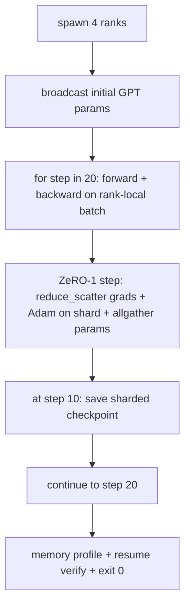

# 端到端分布式训练

> 第 76 至 80 课分别构建了一个组件。本课将它们组装起来：在 4 个模拟 rank 上训练一个微型 GPT，使用 DDP 同步梯度、使用 ZeRO-1 对优化器状态分片，并在训练中点保存分片检查点。演示程序运行 20 步后自行终止，打印损失曲线与内存概况，并写出可恢复的检查点。

**Type:** 构建
**Languages:** Python
**Prerequisites:** 阶段 19 路线 C 第 42–49 课
**Time:** 约 90 分钟

## 学习目标

- 把 DDP（第 77 课）、ZeRO-1（第 78 课）与分片检查点（第 80 课）组合进同一个训练循环。
- 在 4 个模拟 rank 上，用小型合成语料训练一个双层 Transformer 语言模型，共运行 20 步。
- 打印逐步损失表、逐 rank 内存概况，以及能够在相同 world size 下恢复且字节完全一致的检查点清单。
- 论证这种组合：前面各课已经分别验证每个组件，而本课证明它们能够协同工作。

## 问题

综合项目的意义在于证明各个组件能够组合。第 76 课实现集合通信，第 77 课把它们封装成 DDP，第 78 课使用 reduce_scatter 对优化器状态进行分片，第 79 课分析流水线，第 80 课保存分片检查点。每一课都能独立运行并拥有自己的测试。真实训练则会同时使用所有原语；如果组合有误，损失会发散、检查点无法恢复，或者本应下降的逐 rank 内存反而增长。

本课会运行端到端演示，并验证四项不变量：（a）在浮点噪声范围内，损失在 20 个步骤中单调下降；（b）每个 rank 在每一步都持有相同的参数范数；（c）每个 rank 的优化器内存等于 ZeRO-1 公式 12P/N 字节；（d）第 10 步的检查点在重启后能够以逐字节相同的方式重新加载。演示会自行终止：20 步、单条命令、退出码为 0。

## 概念



### 微型 GPT

模型刻意保持很小：2 个 Transformer 块、嵌入维度 32、4 个注意力头、词表大小 64、序列长度 16、批次大小 4，总计数千个参数。它足够大，可以覆盖每项连线决策（多头注意力采用标准掩码路径；LayerNorm 有需要同步的权重；LM head 是一个单独映射回词表的线性投影）。它又足够小，可以让 4 个 CPU rank 上的 20 步训练在数秒内完成。

### 组合规则

| 课程组件 | 负责内容 | 留给循环的内容 |
|--------------|--------------|----------------------------|
| DDP 广播 | 初始参数同步 | 构造时调用一次 |
| ZeRO-1 步骤 | 梯度同步、主副本更新、参数广播 | 每步调用一次，取代 optimiser.step |
| 分片检查点 | 持久化逐 rank 状态、保存带 sha256 的清单 | 在 rank 0 上使用通过 allgather 收集的状态调用 |
| 训练循环 | 前向传播、反向传播、损失记录 | 按顺序调用上述三个组件 |

循环不需要知道 reduce_scatter 或会合文件的细节。ZeRO 与检查点模块公开狭窄接口，供循环组合。

### 为什么使用微型 GPT，而不只是 MLP

第 77 课的 MLP 已足以验证梯度同步。微型 GPT 额外带来三点：面向词表的独立 LM head（本课为清晰起见不与 token embedding 绑定；完整 GPT 通常会绑定二者）、作为损失函数的 softmax + 交叉熵（数值边界情况比 MSE 更多），以及非对称前向过程（嵌入，然后每层依次经过注意力与 MLP）。如果综合项目仍只使用 MLP，就无法暴露组合过程是否正确处理 LayerNorm 或嵌入层梯度形状。

### 自行终止意味着以 0 退出

循环固定运行 20 步后退出。没有 `while True`，不需要人工干预，也不依赖外部状态恢复。一项能够无人看管地运行，并在结束时留下完整日志的综合项目，才能证明系统连线正确。如果任何组件发生死锁，演示就不会返回，测试装置会捕捉到它。

```figure
ci-distributed-assembly
```

## 动手构建

`code/main.py` 实现：

- `MiniGPT`：带掩码自注意力与独立 LM head 的双层 Transformer。
- `make_corpus(seed, total_tokens)`：生成确定性的下一 token 预测数据。
- `_train_worker`：每个 rank 启动一个；广播初始参数、运行循环、调用 ZeRO 步骤，并在第 10 步写入分片检查点。
- `verify_resume`：主运行结束后，在进程内重新加载第 10 步检查点，并断言保存的主分片与内存快照逐字节相同。
- `main`：编排整个演示，打印损失表、内存概况与验证结果。

运行：

```bash
python3 code/main.py
```

输出包括：20 行损失表、4 行逐 rank 内存概况、一份检查点清单，以及成功时的一行“RESUME VERIFIED”。

## 生产环境中的常见模式

真实训练通常采用三种模式来完成这套组合。

**每 K 分钟保存检查点，而不是每 K 步。** 步骤耗时会随序列长度与微批次数量变化。每 10 分钟保存一次检查点，无论模型大小如何，都能覆盖相同的计算量。本课为了简化而按步骤保存，生产环境则按实际时间保存。

**尽早检测发散。** 生产训练会在反向传播后增加 NaN 防护与损失突增检测器；如果损失在一步内增长超过 2 倍，就回滚到上一个检查点，而不是让优化器继续进入退化状态。本课的损失曲线很平滑，因此不会触发该防护，但接口仍保留。

**跨 rank 汇总内存概况。** 真实训练中的逐 rank 内存并不相同（持有最大流水线阶段的 rank 会保存更多激活值）。生产系统会记录所有 rank 的最大值与平均值；本课则打印每个 rank，以显示结果符合公式。

## 实际应用

生产模式：

- **DeepSpeed。** 通过一份配置组合 DDP + ZeRO + 流水线 + 激活检查点。本课展示的是 DeepSpeed 架构的微型版本。
- **PyTorch FSDP。** 原生等价方案。`FullyShardedDataParallel` 使用 `ShardingStrategy.SHARD_GRAD_OP` 时对应 ZeRO-2。
- **NeMo 与 Megatron-LM。** 为最大规模模型加入张量并行；除此之外，组合形态相同。

## 交付成果

完整路线到此结束。六节课程共同组成了真实团队在采用 DeepSpeed 前会构建的分布式训练子系统；该抽象已经在 gloo 上验证，相关失败模式也已经过演练。阶段 17（基础设施与生产）会把这套组合带到真实集群。

## 练习

1. 对注意力头添加张量并行拆分，并验证损失与单 rank 基线一致。使用两个 rank：每个 rank 负责一半注意力头，并对注意力输出执行 allreduce。
2. 添加跨 4 个微批次的梯度累积，证明结果梯度等于一个大批次的梯度。
3. 添加从第 10 步实际恢复的路径，继续训练到第 20 步，并得到与原始运行相同的最终损失。
4. 把指标（损失、梯度范数、步骤耗时）导出到 JSONL，让运行结束后能够可视化。
5. 添加 NaN 防护，使系统在损失突增时回滚到前一个检查点；通过单步学习率倍增器强制制造一次突增，以演练回滚。

## 关键术语

| 术语 | 人们通常怎么说 | 实际含义 |
|------|----------------|------------------------|
| 端到端 | “全部连起来” | 一次运行组合全部组件，而不是每个组件各做一次单元测试 |
| 内存概况 | “每个 rank 占多少 GB” | 每个 rank 为参数、梯度与优化器状态持有的字节数 |
| 恢复契约 | “保存与加载” | 检查点往返后，每个 rank 的状态逐字节相同 |
| 自行终止 | “有界运行” | 固定步骤数、完成后以 0 退出、过程中无需人工介入 |

## 延伸阅读

- [DeepSpeed 端到端训练教程](https://www.deepspeed.ai/getting-started/)
- [PyTorch FSDP 高级教程](https://pytorch.org/tutorials/intermediate/FSDP_advanced_tutorial.html)
- [Megatron-LM 训练脚本参考](https://github.com/NVIDIA/Megatron-LM)
- 阶段 19 第 76–80 课——本课组合的各个组件
- 阶段 17——把这套组合迁移到真实集群
