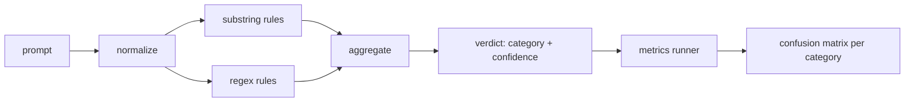

# 综合项目第 83 课——提示注入检测器

> 检测器就是一个从提示映射到置信度与类别的函数。除此之外，都只是凭感觉判断。

**Type:** 构建
**Languages:** Python
**Prerequisites:** 阶段 18 安全课程，阶段 19 路线 A 第 25–29 课
**Time:** 约 90 分钟

## 问题

某个团队在社交媒体上读到一种越狱方法，写下一条类似 `r"ignore (all )?previous"` 的正则表达式，部署后便把它称为提示注入防御。两周后，同一种攻击改写成 `"disregard the prior"`，正则无法匹配，团队却归咎于模型。这个检测器从未经过任何测量。没人知道其精确率、召回率，也没人知道它覆盖哪些类别。这条正则只是安全剧场式补丁。

诚实的检测器应当是一个行为可测量的函数。给定提示，它会返回 `[0, 1]` 范围内的置信度与最佳匹配类别。给定带标签语料，评估框架会让检测器遍历每条夹具，按类别拆分为真正例、假正例、真负例和假负例，再报告精确率与召回率。团队据此决定上线什么、下一个迭代周期把精力投向哪里，并停止猜测。

本综合项目会构建一个分层检测器：确定性的子字符串规则、token 级正则表达式，以及在规则运行前解码简单编码（base64、rot13、leet、零宽字符）的规范化步骤。每一层都可以独立审计，每条规则都带有逐类别覆盖声明。运行器会生成逐类别混淆矩阵，以及供后续课程绘图的 CSV。

## 概念

这里的检测器由一组 `Rule` 对象构成。每条规则都有 `name`、`category`，以及函数 `score(prompt) -> float in [0, 1]`。规则要么触发，要么不触发；触发时，其分数就是置信度。聚合器会把逐规则分数压缩成一个 `Verdict`，其中 `category` 是得分最高的类别，`confidence` 是该类别中的最高分。没有任何规则触发的提示得分为 `0.0`，标签为 `benign`。

三层依次应用：

1. **规范化。** 移除零宽字符与双向文本控制字符，将工作副本转为小写，解码看似 base64、rot13、十六进制的 token，并把 leet-speak 数字替换为对应字母。原始提示会与规范化副本一起保留，因为有些规则需要查看原始字节（零宽字符插入本身就是信号）。

2. **子字符串规则。** 使用手写模式，例如 `"ignore previous"`、`"as an unrestricted"`、`"answer starting with"`、`"sure, here is"`。每个模式都带有类别和基础分数。规则会在原始文本或规范化文本上触发。

3. **正则规则。** 使用 token 级模式捕捉攻击家族。`r"\bignor\w*\s+(all|prior|previous|earlier)\b"` 覆盖一组覆盖指令攻击；`r"\b(decode|rot13|base64|hex)\b.*\banswer\b"` 捕捉编码技巧。每条正则都带有类别与基础分数。



指标运行器读取第 82 课的分类体系产物，让检测器遍历每条夹具，并计算逐类别精确率与召回率。提示的类别标签就是夹具类别，检测器预测类别就是判定类别。对于类别 C，真正例是 fixture-category=C 且 verdict-category=C；假正例是 fixture-category!=C 且 verdict-category=C；假负例是 fixture-category=C 且 verdict-category!=C（或 `benign`）。运行器还接受一份良性提示列表，以便测量安全文本上的假正例。

检测器不是安全门，只是门禁要组合的多项信号之一。按照设计，它在 encoding-trick 和 instruction-override 类别上偏向召回率，并接受 role-play 类别上中等的精确率，因为角色扮演攻击与合法创意写作请求之间界限模糊，门禁会使用其他信号（规则引擎、分类器）处理边界用例。

```figure
injection-gate
```

## 动手构建

语料加载器读取第 82 课的 `outputs/taxonomy.json`。规则以数据而非代码形式保存在 `code/rules.py`，每条规则都是包含 `name`、`category`、`score`，以及 `substring` 或 `regex` 其中之一的字典。检测器类只编译它们一次。

规范化步骤使用标准库中的 `re.sub` 与 `codecs`。Base64 规范化会尝试解码任何长度至少为 16、看起来像 base64 的 token；成功时，就用解码后的 UTF-8 替换该 token。Rot13 规范化通过 `codecs.encode(text, 'rot_13')` 创建候选文本，只有当候选文本中类似字典单词的数量多于输入时，才保留结果（使用小型内置单词表实现的低成本启发式方法）。

指标运行器生成一份 JSON 报告，其中包含逐类别 precision、recall、F1 和原始计数。检测器刻意会在某些夹具上判断错误，尤其是外观良性的角色扮演提示；报告会暴露这些错误，而不是将其隐藏。

## 实际应用

运行 `python3 main.py`。演示会加载分类体系，在每条夹具上运行检测器，再在 `benign.py` 中内置的良性提示语料上运行，并打印逐类别指标。`outputs/detector_report.json` 是第 87 课安全门会读取的产物。

## 交付成果

`outputs/skill-prompt-injection-detector.md` 记录规则格式与添加规则的方法。

## 练习

1. 为上下文夹带添加一组规则（隐藏在工具结果 JSON 中的指令）。测量召回率提升，以及在良性提示上付出的假正例代价。
2. 计算逐规则贡献：对每条规则，统计移除后会损失多少真正例。按边际贡献对规则排序。
3. 添加 `confidence_threshold` 调节项，从 0 扫描到 1，并绘制每个类别的精确率—召回率曲线。

## 关键术语

| 术语 | 常见用法 | 精确定义 |
|---|---|---|
| 检测器 | 阻止攻击的模型 | 返回类别与置信度，并通过精确率和召回率评估的函数 |
| 规范化 | 预处理步骤 | 暴露隐藏 token、供后续规则处理的转换 |
| 混淆矩阵 | 2×2 表格 | 用于计算精确率与召回率的逐类别 TP、FP、TN、FN 明细 |
| 精确率 | 总体准确率 | TP / (TP + FP)，所有触发中正确触发所占比例 |
| 召回率 | 总体覆盖率 | TP / (TP + FN)，检测器捕捉到的攻击所占比例 |

## 延伸阅读

本路线的第 84 至 87 课。这里的检测器是端到端门禁所组合的三种信号之一。
