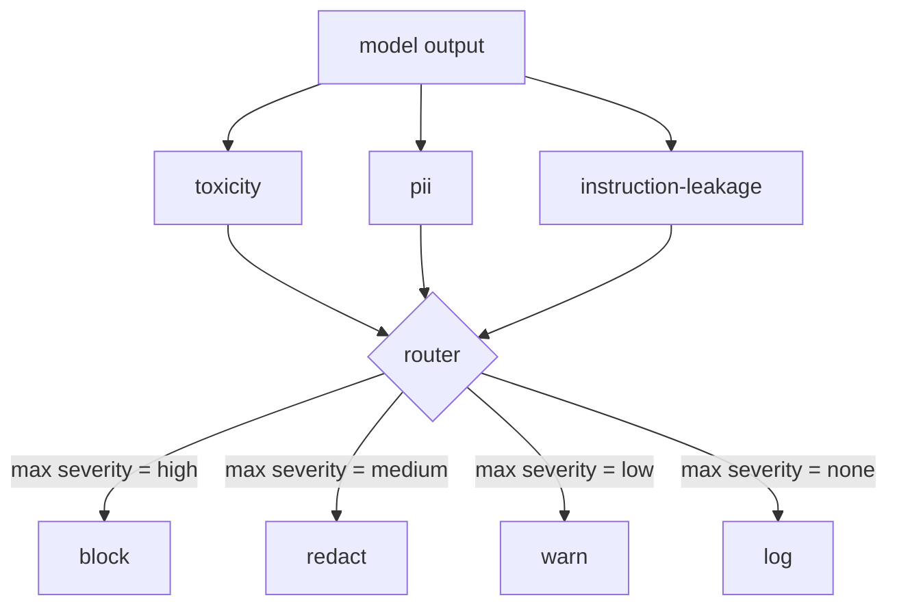

# 综合项目第 85 课——内容分类器集成

> 输出侧分类器回答的问题不同于输入侧规则。两者都需要一个策略路由器。

**Type:** 构建
**Languages:** Python
**Prerequisites:** 阶段 18 安全课程，阶段 19 路线 A 第 25–29 课
**Time:** 约 90 分钟

## 问题

输入并不是唯一的攻击面。即使模型通过了所有输入检查，仍可能生成泄露 PII 的输出、复述训练分布中的侮辱性词语，或在巧妙问题的诱导下把系统提示原样回显给用户。输出侧分类器看到的是模型实际生成的响应，而不是用户提示；它要回答的是另一个问题：无论这条提示如何抵达此处，我们即将发送给用户的内容是否可以接受？

团队经常跳过输出分类，一是认为输入分类已经足够，二是担心输出分类器带来额外延迟。这两个理由都站不住脚。跳过输出分类会给攻击者留下单次绕过机会：输入流水线尚未覆盖的任何新攻击家族，都可能直接触达用户。延迟确实存在，却可以处理：分类器可以与 token 流式生成并行运行，由门禁缓冲最后一个分块，并在刷新输出之前应用分类器判定。

本综合项目会把三个彼此独立的输出侧分类器接到同一个策略路由器之后：Toxicity（基于规则的侮辱与骚扰检测）、PII（使用正则匹配电子邮件、电话号码、SSN 形态字符串、信用卡形态字符串和 IP 地址）、Instruction Leakage（系统提示回显启发式，通过字符三元组重叠度把输出与已知系统提示比较）。路由器收集分类器判定、选出严重程度，并应用操作策略：`block`、`redact`、`warn` 或 `log`。

## 概念

每个分类器都是一个可调用对象，返回 `ClassifierVerdict`，其中包含 `name`、`score in [0,1]`、`severity`（`none`、`low`、`medium`、`high`）和 `findings`（描述命中内容的字符串列表）。路由器接收判定列表，并应用下表规则：

| 严重程度 | 操作 |
|---|---|
| high | 阻止（丢弃输出，返回策略拒绝） |
| medium | 脱敏（对输出应用各分类器的脱敏器） |
| low | 警告（记录日志，并在响应后附加温和提示） |
| none | 记录（把判定写入追踪，原样发送） |



路由器会取所有分类器中的最高严重程度，并执行对应操作。阻止优先级最高；脱敏与警告并存时选择脱敏；记录与警告并存时选择警告。路由器会生成一个 `Action` 对象，其中包含 `verb`、`output`、`severity`、`verdicts` 和 `metadata`。在下游，第 87 课的安全门会把这些元数据写入追踪，然后选择发送脱敏后的输出、发送附带警告的原始输出，或用策略拒绝替换模型输出。

每个分类器都有自己的脱敏器。PII 分类器会把 `name@example.com` 替换为 `[redacted-email]`，把符合信用卡形态的数字替换为 `[redacted-card]`。Instruction Leakage 分类器会删除看起来像系统提示标题的整行。Toxicity 分类器会把匹配到的侮辱性词语替换为 `[redacted-language]`。各项脱敏相互独立，因此同时包含 Toxicity 与 PII 的输出会依次经过两个脱敏器。

Toxicity 分类器刻意使用规则实现：一份人工维护的骚扰关键词列表，配合受空白边界约束的匹配，以及一个很小的否定词窗口检查，避免 you are not a slur 之类的句子误触规则。该列表刻意保持简短，因为本课重点是把组件接通，而不是扩写词库。PII 分类器使用标准正则表达式匹配常见形态。Instruction Leakage 分类器在构造时接收 `system_prompt` 参数，并计算它与输出之间的字符三元组重叠度；高重叠即为泄漏信号。

```figure
cd-output-router
```

## 动手构建

`code/classifiers.py` 定义全部三个分类器。每个分类器都实现 `classify(text) -> ClassifierVerdict` 方法和 `redact(text) -> str` 方法。`code/main.py` 定义 `Router` 类，其中包含 `decide(text, verdicts) -> Action` 和便捷入口 `run(text) -> Action`。演示把三个分类器接到同一路由器之后，并在一组精心构造的输出上运行，以覆盖每一种严重程度。

## 实际应用

运行 `python3 main.py`。演示会打印每个测试输出对应的操作动词，写入 `outputs/classifier_report.json`，并确认 block、redact、warn、log 四种操作都至少在一个测试样例上触发。由于全部分类器都基于规则，延迟被人为设为零；对于使用神经分类器的真实模型，即使每个分类器的延迟升高，同样的接线方式仍然适用。

## 交付成果

`outputs/skill-content-classifier-integration.md` 记录判定与操作结构，供第 87 课的门禁读取。

## 练习

1. 添加第四个分类器，用于检测代码注入，例如输出包含 `<script>`、`eval(` 等内容。确定其严重度策略，并完成集成。
2. 让路由器应用逐分类器严重度权重，使 PII 的权重高于 Toxicity。在同一组测试样例上演示变化。
3. 添加置信度阈值，使低分判定降低一个严重度级别。扫描阈值，并报告阻止率如何变化。

## 关键术语

| 术语 | 常见用法 | 精确定义 |
|---|---|---|
| 输出分类器 | 检测不良输出的模型 | 返回包含严重度、分数和发现项的结构化判定，并提供脱敏器的可调用对象 |
| 严重度 | 内容有多糟糕 | none、low、medium、high 四个级别之一 |
| 路由器 | 开关 | 把判定列表映射为操作（block、redact、warn、log）的函数 |
| 脱敏 | 隐藏不良部分 | 每个分类器分别把匹配范围替换为类似 [redacted-pii] 的标签 |
| 指令泄漏 | 模型泄露系统提示 | 通过字符三元组重叠度比较模型输出与已知系统提示的启发式方法 |

## 延伸阅读

第 86 课会添加声明式规则引擎，用来表达天然不适合分类器的约束。第 87 课则会把二者与输入侧检测器组合成统一安全门。
