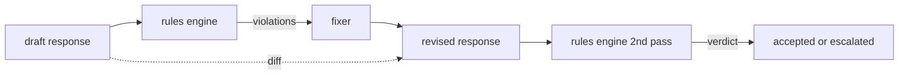

# 综合项目第 86 课——宪法规则引擎

> 一条规则由名称、谓词和解释组成。缺少其中任何一项，都只是凭感觉判断，而不是规则。

**Type:** 构建
**Languages:** Python、YAML
**Prerequisites:** 阶段 18 安全课程，阶段 19 路线 A 第 25–29 课
**Time:** 约 90 分钟

## 问题

分类器负责可识别的失败，规则引擎负责契约性要求。开发编码助手的团队可能希望添加这样的约束：“任何包含代码的响应，结尾必须是可运行代码块或明确声明的假设。”运营客户支持机器人的团队则可能要求：“每次拒绝都必须提供下一步建议。”这些约束并不适合作为自然分类器目标。它们是作用于响应、对话与系统策略的谓词，而且必须让非工程人员也能理解。

诚实的表达方式是一份声明式文件。宪法以 YAML 形式与代码一起存入版本控制，并采用独立的审查流程。每条规则包含 `name`、`predicate`、`severity` 和 `explanation` 模板。引擎加载文件，对候选输出评估每条规则，并为每条触发的规则返回结构化 `Violation`。本综合项目中的规则引擎使用 `all_of`、`any_of` 和 `not_` 组合谓词，因此单条规则就能表达：“如果响应包含代码，它必须以可运行代码块结束，并且不得引用仅供内部使用的库。”

本课的另一半是修订。只能阻止内容的规则引擎只完成了一半。能够提出修复的规则引擎才具备实际运维价值：助手先起草响应，引擎标记违规，修复器生成修订响应，引擎再确认修订版是否满足规则。本课提供一个最小修复器（按规则执行正则替换），以及草稿与修订版之间的结构化 diff（逐行新增、删除、编辑）。

## 概念



一条规则具有以下形态：

```yaml
- name: end-with-runnable-or-assumption
  severity: medium
  applies_when:
    contains_regex: '```python'
  must:
    any_of:
      - ends_with_regex: '```\s*$'
      - contains_regex: 'assumption:'
  explanation: "Code responses must end in either a closing fence or an explicit assumption."
  fix:
    append_if_missing: "\n\nAssumption: example inputs are valid."
```

原子谓词包括：`contains_regex`、`not_contains_regex`、`ends_with_regex`、`starts_with_regex`、`max_words`、`min_words`。组合谓词包括 `all_of`、`any_of`、`not_`。引擎会先评估 `applies_when`；如果规则不适用，就把结果记录为 `not_applicable`。否则，引擎评估 `must`，并生成 `pass` 或 `violation`。

严重程度分为 `low`、`medium`、`high`，与第 85 课一致。下游门禁（第 87 课）会把 `high` 级规则违规与 `high` 级分类器判定同等处理：阻止执行。

修复器由一组声明式操作组成：`append_if_missing`、`prepend_if_missing`、`replace_regex`。每项操作按名称把一条规则映射到一次转换。修复器刻意只允许局部编辑；结构性重写应交给本课范围之外的独立“拒绝并提供帮助”层。

Diff 针对原始版本与修订版本计算。它是一组 `Change` 记录，每条包含 `op`（add、remove、edit）以及相关文本。下游门禁可以记录这份 diff，让人类审阅者长期审计修复器的行为。

```figure
cd-constitution-loop
```

## 动手构建

`code/rules.yml` 保存宪法。`code/main.py` 中的加载器既可以接受 YAML 文件（安装了 PyYAML 时），也可以接受 JSON 文件（内置支持）。本课附带的 `rules.yml` 可由两条代码路径解析。`code/main.py` 定义 `Engine`、`Fixer` 类和一个 `diff` 函数。组合谓词会递归求值，并在 `any_of` 上短路。

随附宪法包含：

- `no-empty-refusal`（medium）——拒绝必须包含建议或重定向。
- `end-with-runnable-or-assumption`（medium）——代码响应必须完整闭合。
- `no-pii-in-examples`（high）——示例数据不得包含电子邮件或电话号码形态。
- `cite-when-asserting-fact`（low）——以“According to”开头的行必须包含括号引文。
- `no-internal-library-leak`（high）——输出中不得出现 `internal-only` 与 `policybot-internal`。
- `bounded-length`（low）——响应不得超过 800 个单词。

## 实际应用

运行 `python3 main.py`。演示会让三份响应草稿经过引擎、打印违规项、运行修复器、打印 diff，并写入 `outputs/rules_report.json`。其中一个夹具包含一条不适用规则（草稿中没有代码块），报告会为该规则显示 `not_applicable`，让团队看到引擎确实显式评估过它。

## 交付成果

`outputs/skill-constitutional-rules-engine.md` 记录规则语法与修复器操作。

## 练习

1. 添加一条规则：当提示提到安全时，每条响应都必须包含短语“If this is urgent”。使用组合谓词。
2. 用接受具名槽位的模板修复器替换正则修复器，并演示在新设计下重写一条规则。
3. 添加指标端点：给定一组响应草稿，返回逐规则违规率，让团队看到哪条规则触发过度。

## 关键术语

| 术语 | 常见用法 | 精确定义 |
|---|---|---|
| 宪法 | 含糊的策略文档 | 一份由谓词、严重程度与解释组成的 YAML 规则文件 |
| 谓词 | 一项检查 | 从文本映射到 bool 的可调用对象，可以是原子谓词，也可以通过 all_of/any_of/not_ 组合 |
| 违规 | 失败 | 包含规则名称、严重程度、解释和匹配范围的结构化记录 |
| 修复器 | 模型微调 | 按规则执行的确定性转换，把草稿映射为修订版 |
| 差异 | 字符串比较 | 草稿与修订版之间由 add、remove、edit 操作组成的结构化列表 |

## 延伸阅读

第 87 课会把本引擎与输入侧检测器、输出侧分类器组合成一个安全门。
