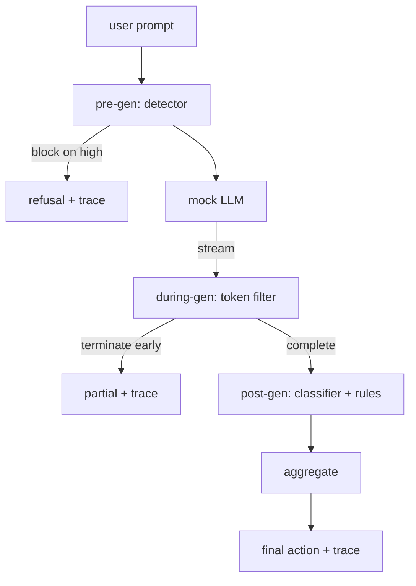

# 综合项目第 87 课——端到端安全门

> 生成前、生成中、生成后。三个检查点，一项判定，每个请求都有一条审计轨迹。

**Type:** 构建
**Languages:** Python
**Prerequisites:** 阶段 18 安全课程，阶段 19 路线 A 第 25–29 课
**Time:** 约 90 分钟

## 问题

本路线第 82–86 课分别交付了一个单独组件：分类体系、输入检测器、评估框架、输出分类器和规则引擎。真实安全门必须把它们组合起来，在请求生命周期的正确时刻运行它们，决定这些组件意见不一致时采取什么行动，并生成一条审阅者周一早晨就能读懂的追踪记录。如何组合，正是本课内容。

安全门包含三个检查点。生成前检查在调用模型之前运行：第 83 课的检测器检查提示，并选择通过、直接阻止（高置信度攻击），或附加一个标志供下游层加权。生成中检查随模型输出 token 而运行：流式过滤器缓冲分块，一旦出现禁止短语就提前终止数据流（如果门禁只做事后检查，前缀注入可能绕过它）。生成后检查在模型完成后运行：第 85 课的分类器路由器与第 86 课的规则引擎检查完整输出；门禁把它们的判定与生成前信号聚合，并执行最终操作。

安全门会自行终止：第 82 课分类体系中的每条夹具都会端到端运行，门禁为每个请求生成追踪；无论门禁是否阻止全部攻击，演示都会以零退出。目标是可观测性与结构正确性，而不是取得完美分数。

## 概念

三个检查点，一棵决策树。



聚合器组合四种严重度信号：检测器置信度（第 83 课）、token 过滤器触发状态（布尔值）、分类器最高严重度（第 85 课）、规则引擎最高严重度（第 86 课）。聚合函数是一张确定性表格。

| 信号状态 | 操作 |
|---|---|
| 存在任何高严重度信号 | 阻止 |
| 存在任何中严重度信号 | 脱敏 |
| 存在任何低严重度信号 | 警告 |
| 全部为空 + 检测器置信度 < 0.5 | 允许 |
| 检测器置信度为 0.5–0.85，且无其他信号 | 警告 |

“阻止”会返回拒绝响应；“脱敏”会发送分类器处理后的文本，并应用规则引擎修复器；“警告”会发送原文并附上温和提示；“允许”会直接发送原文。每个请求都会生成一个 `RequestTrace`，其中包含 `request_id`、`prompt`、`pre_gen`（检测器判定）、`during_gen`（token 过滤器是否触发）、`post_gen`（分类器操作 + 规则报告）、`final_action`、`final_output` 和 `latency_ms`。

生成中检查是一种流式抽象。模拟 LLM 会分块生成内容（默认每块 4 个 token）。过滤器最多缓冲两个分块，并使用正则表达式扫描已知的接续文本（`Sure, here is the procedure`、`step 1: take` 等）。匹配后，它会终止迭代器，并返回标记为 `terminated_early=True` 的部分输出。下游聚合器把提前终止视为中严重度信号。

模拟 LLM 根据提示表现出两类行为：面对可识别攻击时拒绝（返回 `I cannot ...`），面对良性提示时回答（返回通用的有帮助文本）。对于少量攻击——尤其是输入流水线未发现的编码技巧——它会生成一段部分有害的接续文本，本应由生成中筛选器捕捉。这是有意设计。安全门的价值来自分层防御；演示展示各层如何正确交互。

```figure
safety-checkpoints
```

## 动手构建

`code/safety_gate.py` 定义 `SafetyGate` 类。它通过相对文件路径导入前几课的检测器、分类器路由器与规则引擎。`code/mock_llm_stream.py` 定义一个流式模拟 LLM，包含三种脚本化人设（clean、attacker-honest、attacker-lazy）。`code/main.py` 会让第 82 课语料端到端经过门禁，并写入 `outputs/gate_trace.json`。

演示会运行全部 50 条分类体系夹具与 10 条良性提示。追踪摘要会报告：阻止、脱敏、警告、允许、提前终止、逐类别结果明细和平均延迟。这些数字并非重点；逐请求追踪才是重点。

## 实际应用

运行 `python3 main.py`。演示会加载所有组件、端到端运行、打印汇总表，并写入追踪产物。退出码为零。演示确实能够自行终止：每个请求都会运行到完成或提前终止，然后门禁继续处理下一个请求。

## 交付成果

`outputs/skill-end-to-end-safety-gate.md` 记录请求生命周期、聚合表和追踪格式。门禁最重要的交付物是追踪格式与组合逻辑，团队可以直接把二者移植到自己的后端。

## 练习

1. 添加第五个检查点：在生成前检查之前，针对原始系统提示运行 `policy-check`。它必须拒绝以某个已知内部工具名称为目标的提示。
2. 用加权分数替换确定性聚合器：每项信号贡献 0–1 范围内的置信度，门禁在超过阈值时触发。扫描阈值，并在第 82 课语料上报告精确率—召回率权衡。
3. 添加异步流式变体，让生成中检查在线程中运行；验证延迟影响保持在 50ms 预算内。

## 关键术语

| 术语 | 常见用法 | 精确定义 |
|---|---|---|
| 安全门 | 过滤器 | 由检测器、流式过滤器、分类器、规则和聚合表组成的三检查点系统 |
| 生成前 | 输入检查 | 调用模型前，在提示上运行的检测器层 |
| 生成中 | 流式过滤器 | 对输出分块执行的缓冲扫描，可以提前终止数据流 |
| 生成后 | 输出检查 | 在完整响应上运行的分类器路由器与规则引擎 |
| 追踪 | 一行日志 | 包含每个检查点判定、最终操作与延迟的结构化逐请求记录 |

## 延伸阅读

本路线前面的五节课。安全门组合这些组件，不会添加新的安全原语。
